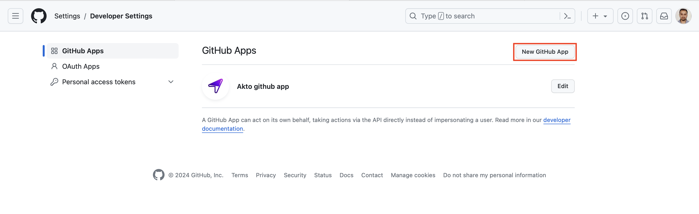
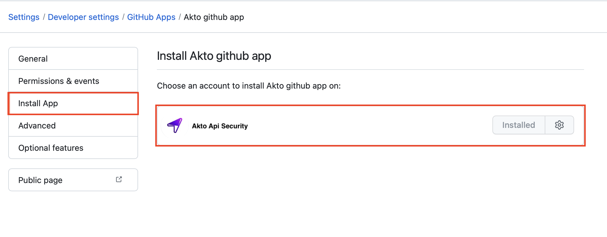
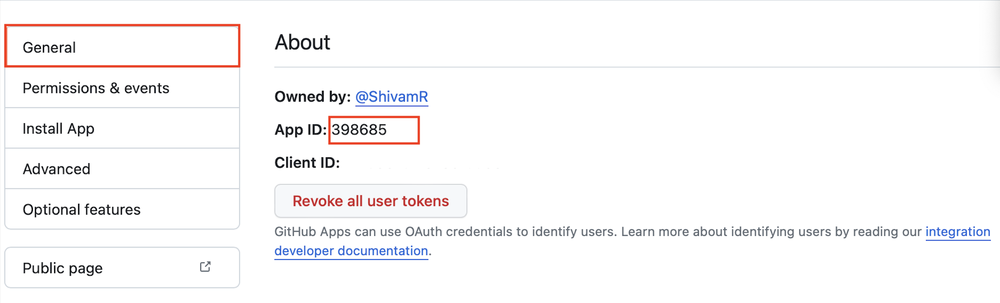
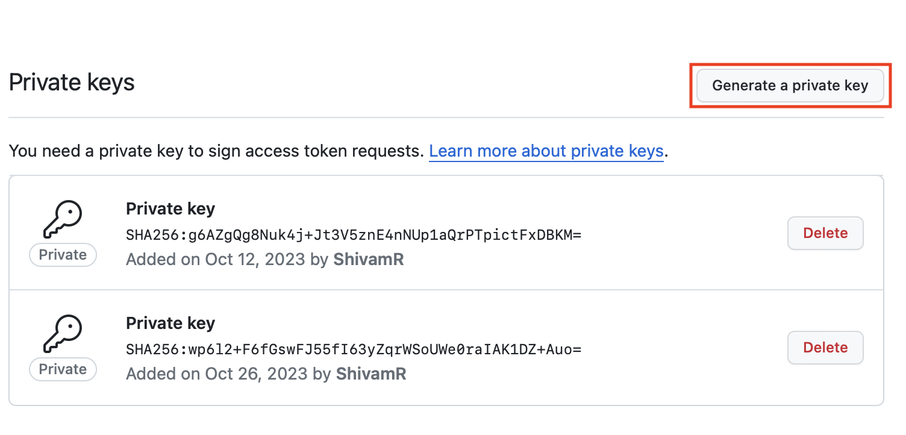
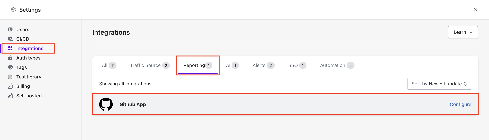
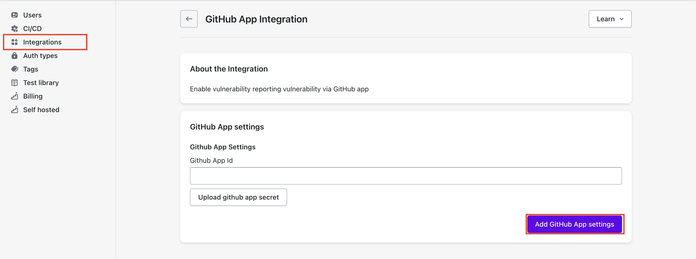
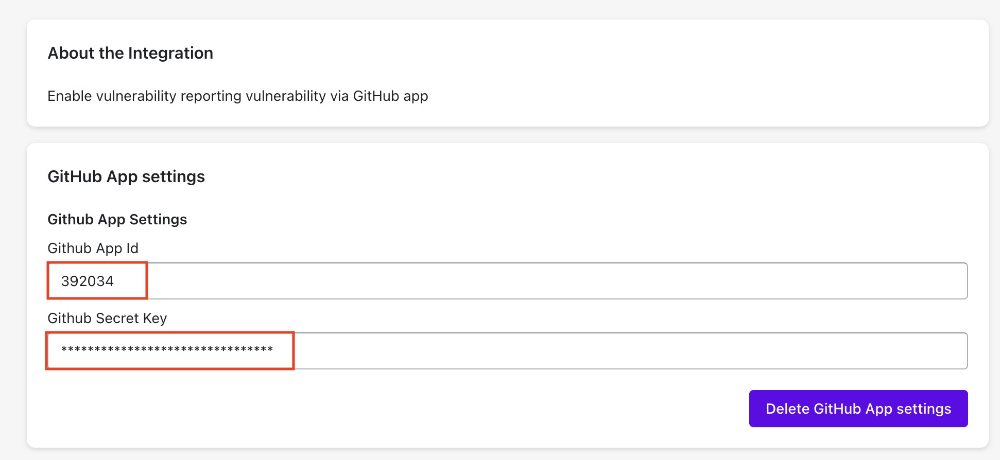

# Github App integration for CICD reporting on Github Pull requests

## **Steps to integrate Github App**

* Create a new Github App from developer settings
* Install created Github App to your repositories
* Integrate the Github App to Akto dashboard

### **Create new Github App**

* Go to `Settings > Developer Settings > Github Apps` on your github dashboard and click `New Github App`

<figure><figcaption></figcaption></figure>

* While creating new Github App, use name as `Akto Github App` with following permissions

  * Read permissions : **Administration**, **code**, **member**, **metadata**
  * Read and write permissions : **checks**, **issues**, **pull requests**

<figure><figcaption></figcaption></figure>

### **Install created Github App**

* After app creation, install github app to your repositories

<figure><figcaption></figcaption></figure>

* Once setup is done you will need **Github App Id** and **Private key** as `.pem` file.

<figure><figcaption></figcaption></figure>

* Download private key as  `.pem` file from steps below.

<figure><figcaption></figcaption></figure>

### **Integrate the Github App to Akto dashboard**

* In Akto dashboard go to `Settings > Integrations > Reporting > Github App` and click `Configure`

<figure><figcaption></figcaption></figure>

* Add Github App Id and upload secret key `.pem` file.

<figure><figcaption></figcaption></figure>

* Final screen after integrating github App.

<figure><figcaption></figcaption></figure>

