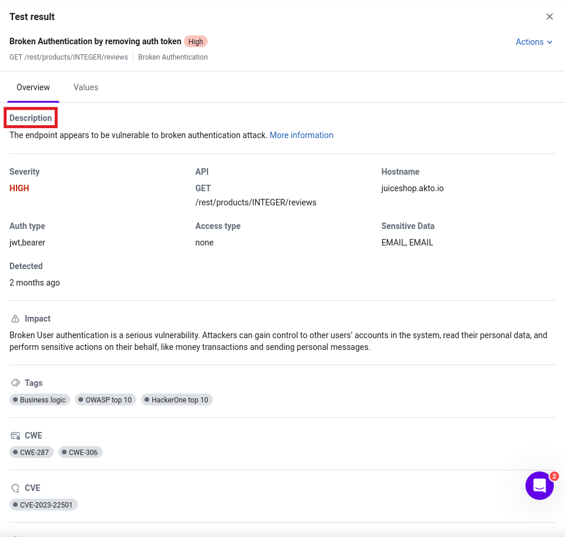
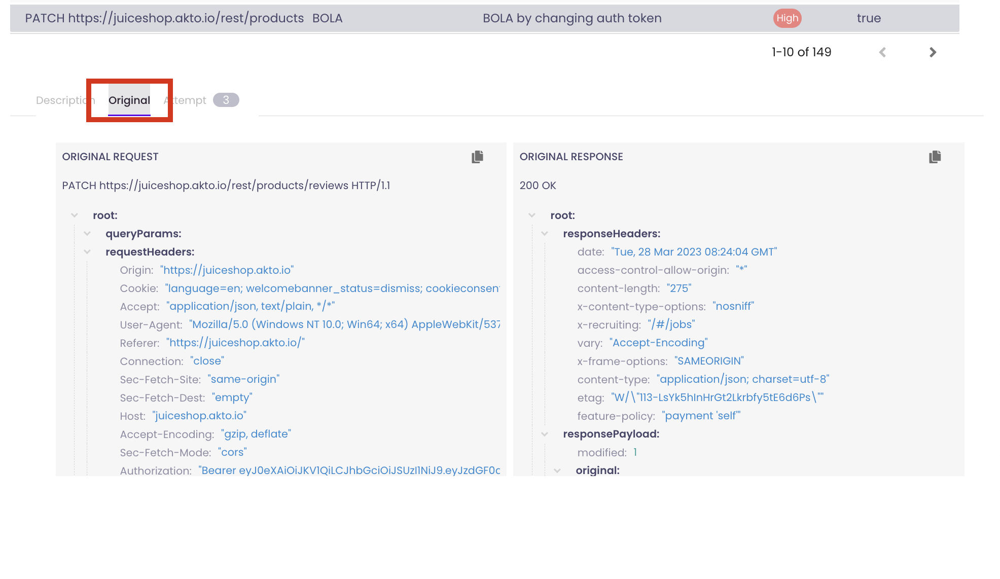
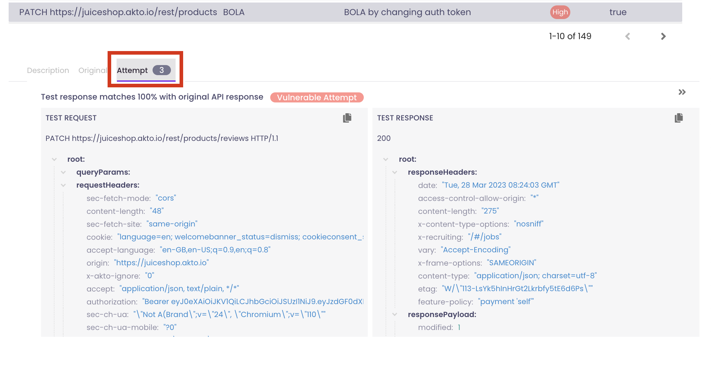

# Test results

You can view all your test results and take action on them in one place.

1.  Go to `Testing` > `Test results`

    <figure><figcaption></figcaption></figure>
2. Use `Scheduled tests` section to find daily scheduled tests. All the past test runs are in the `Previous tests` section.
3.  To see all test runs in a category, click on the heading `All tests`

    <figure><figcaption></figcaption></figure>
4.  To see results for a particular test, select the test run name.

    <figure><figcaption></figcaption></figure>
5.  You can see a list of all test failures with respective `Severity` marked.

    <figure><figcaption></figcaption></figure>
6.  Click on any entry to know the issue description

    <figure><figcaption></figcaption></figure>
7.  Select the `Original` tab to know what was the original request. You can click on the `Copy` icon on the top right to copy it as a `curl` or `Burp` request.

    <figure><figcaption></figcaption></figure>
8.  Select the `Attempt` tab to see what malicious payload(s) Akto sent to find out the vulnerability. Copy button is available here as well. You might want to try it on your own or send it to your dev team.

    <figure><figcaption></figcaption></figure>
