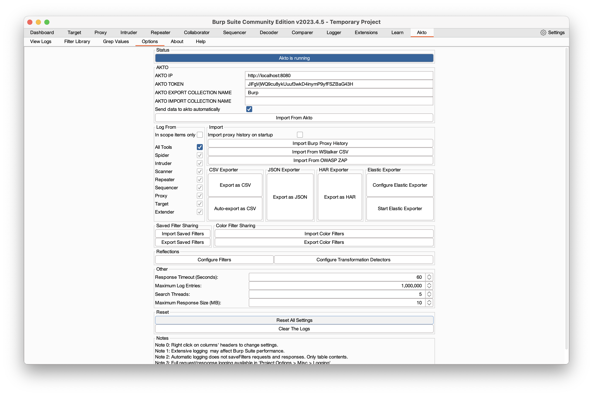
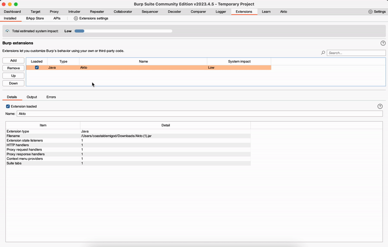

# Burp suite

You can now import API traffic using Akto's burp suite plug-in.&#x20;



Follow these steps:

1. Go to `Quickstart > connect traffic data`
2. Navigate to `burpsuite.`
3. Follow the steps below:

<figure><figcaption></figcaption></figure>

4. You will see all your APIs in the `burp collection` in API inventory. Whenever you browse your application, all the API calls will populate in the Alkto dashboard> API inventory>burp collection.&#x20;

#### FAQs
##### Send only data related to example.com to Akto via Burp
1. In burp suite, open `Target` tab, click on `Scope settings`
   <figure><figcaption></figcaption></figure>
2. Inside the `Scope settings` popup, click on `Add` button inside the `Target scope` section and add the prefix of the url i.e. https://example.com.
   <figure><figcaption></figcaption></figure>
   <figure><figcaption></figcaption></figure>
   <figure><figcaption></figcaption></figure>
3. Now scroll down to `Out-of-scope request handling` section and select the `Drop all out of scope requests` checkbox. Note: this option will not allow the proxy browser to access any other urls and hence data related to no other urls will be sent to Akto.
   <figure><figcaption></figcaption></figure>

#### Akto extension unable to send data after I reinstalled it in burp for a different akto account
1. Load the Akto extension in burp suite and open `Akto` tab, click on `Options` and then click on `Reset All Settings`.
   <figure><figcaption></figcaption></figure>
2. Now click on `Extensions` and reload the akto extension by unchecking and then checking the checkbox. Note: This should load the new settings for the akto extension.
   <figure><figcaption></figcaption></figure>