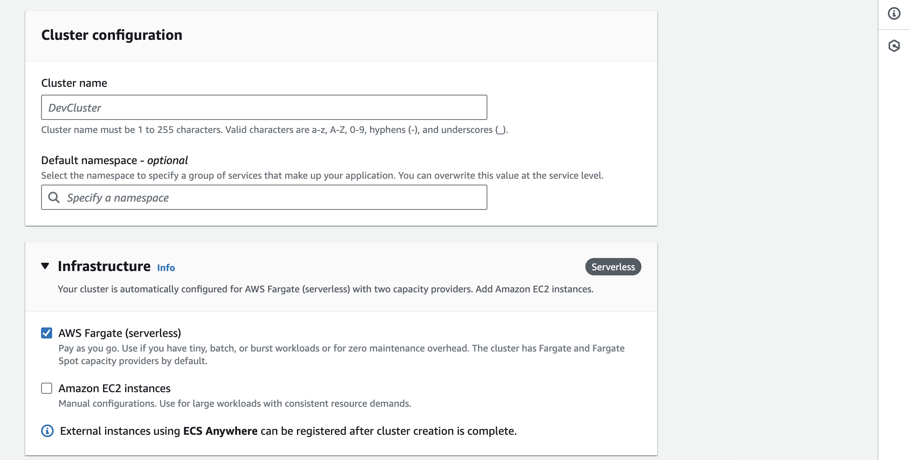

# Connect Akto with AWS ECS

## Introduction

Learn about how to send API traffic data from AWS ECS setup to Akto from your environment.

## Adding Akto traffic collector
AWS ECS can have multiple configurations, please follow the guide according to your setup type.

1. Setup Akto data processor using the guide [here](./data-processor.md)

2. When ECS task is running with launch type AWS FARGATE ( network mode is awsvpc for the task definition ) <figure><figcaption><p>ECS FARGATE launch type</p></figcaption></figure>

    i. We need to add a container to the task definition of the task, from which we want to monitor. Add a container with the configuration defined below:

    ```bash
    {
        "name": "mirror-api-logging",
        "image": "aktosecurity/mirror-api-logging:k8s_agent",
        "cpu": 0,
        "portMappings": [],
        "essential": false,
        "environment": [
            {
                "name": "AKTO_TRAFFIC_BATCH_TIME_SECS",
                "value": "10"
            },
            {
                "name": "AKTO_MONGO_CONN",
                "value": "mongodb://<AKTO_MONGO_IP>:27017/admini"
            },
            {
                "name": "AKTO_TRAFFIC_BATCH_SIZE",
                "value": "10"
            },
            {
                "name": "AKTO_INFRA_MIRRORING_MODE",
                "value": "gcp"
            },
            {
                "name": "AKTO_KAFKA_BROKER_MAL",
                "value": "<AKTO_KAFKA_IP>:9092"
            }
        ],
        "environmentFiles": [],
        "mountPoints": [],
        "volumesFrom": [],
        "systemControls": []
    }
    ```

    <figure><figcaption><p>ECS task definition</p></figcaption></figure>

    ii. After adding this definition to the task, update the task revision in the service. 

    <figure><figcaption><p>Update ECS service</p></figcaption></figure>

    iii. The containers for the task should show both your primary container and mirror-api-logging container.
    
    <figure><figcaption><p>Updated service</p></figcaption></figure>