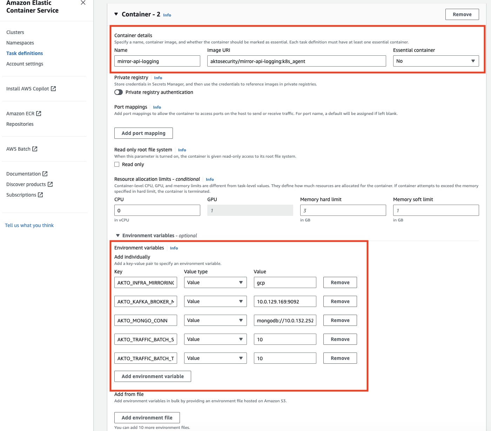
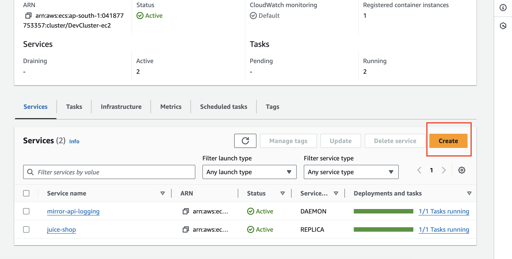
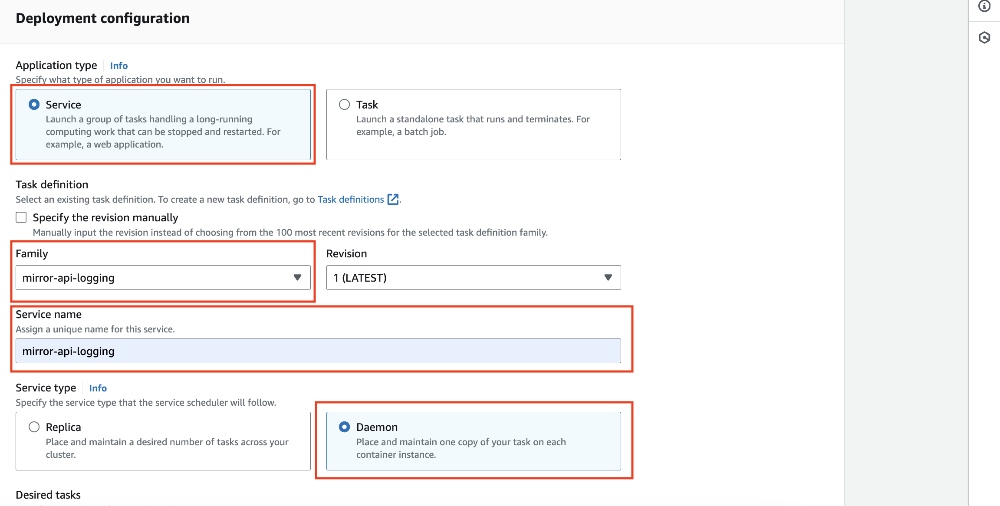

# Connect Akto with AWS ECS

## Introduction

Learn about how to send API traffic data from AWS ECS setup to Akto from your environment.

## Adding Akto traffic collector
AWS ECS can have multiple configurations, please follow the guide according to your setup type.

1. Setup Akto data processor using the guide [here](./data-processor.md)

2. When ECS task is running with launch type AWS FARGATE ( network mode is awsvpc for the task definition ). **If your cluster is an EC2 instance and not a FARGATE cluster, then skip this step and go to the next step.** <figure><figcaption><p>ECS FARGATE launch type</p></figcaption></figure>

    i. We need to add a container to the task definition of the task, from which we want to monitor. Add a container with the configuration defined below:

    ```bash
    {
        "name": "mirror-api-logging",
        "image": "aktosecurity/mirror-api-logging:k8s_agent",
        "cpu": 0,
        "portMappings": [],
        "essential": false,
        "environment": [
            {
                "name": "AKTO_TRAFFIC_BATCH_TIME_SECS",
                "value": "10"
            },
            {
                "name": "AKTO_MONGO_CONN",
                "value": "mongodb://<AKTO_MONGO_IP>:27017/admini"
            },
            {
                "name": "AKTO_TRAFFIC_BATCH_SIZE",
                "value": "10"
            },
            {
                "name": "AKTO_INFRA_MIRRORING_MODE",
                "value": "gcp"
            },
            {
                "name": "AKTO_KAFKA_BROKER_MAL",
                "value": "<AKTO_KAFKA_IP>:9092"
            }
        ],
        "environmentFiles": [],
        "mountPoints": [],
        "volumesFrom": [],
        "systemControls": []
    }
    ```

    <figure><figcaption><p>ECS task definition</p></figcaption></figure>

    ii. After adding this definition to the task, update the task revision in the service. 

    <figure><figcaption><p>Update ECS service</p></figcaption></figure>

    iii. The containers for the task should show both your primary container and mirror-api-logging container.
    
    <figure><figcaption><p>Updated service</p></figcaption></figure>

3. When the ECS cluster is a EC2 instance cluster, we will create a task definition for the mirror-api-logging container and run the task as a daemonset. **If you have done the previous step, skip this one.** <figure><figcaption><p>Cluster configuration</p></figcaption></figure>

    i. We will create a new task definition with launch type as EC2 instances, network mode host and the container details as follows. You can directly create a new task definition using the JSON given below. You can also refer the screenshots attached.

    ```bash
    {
        "family": "mirror-api-logging",
        "containerDefinitions": [
            {
                "name": "mirror-api-logging",
                "image": "aktosecurity/mirror-api-logging:k8s_agent",
                "cpu": 512, 
                "memoryReservation": 512,
                "portMappings": [],
                "essential": true,
                "environment": [
                    {
                        "name": "AKTO_TRAFFIC_BATCH_TIME_SECS",
                        "value": "10"
                    },
                    {
                        "name": "AKTO_MONGO_CONN",
                        "value": "mongodb://<AKTO_MONGO_IP>:27017/admini"
                    },
                    {
                        "name": "AKTO_TRAFFIC_BATCH_SIZE",
                        "value": "10"
                    },
                    {
                        "name": "AKTO_INFRA_MIRRORING_MODE",
                        "value": "gcp"
                    },
                    {
                        "name": "AKTO_KAFKA_BROKER_MAL",
                        "value": "<AKTO_KAFKA_IP>:9092"
                    }
                ],
                "environmentFiles": [],
                "mountPoints": [],
                "volumesFrom": [],
                "ulimits": [],
                "logConfiguration": {
                    "logDriver": "awslogs",
                    "options": {
                        "awslogs-create-group": "true",
                        "awslogs-group": "/ecs/mirror-api-logging",
                        "awslogs-region": "ap-south-1",
                        "awslogs-stream-prefix": "ecs"
                    },
                    "secretOptions": []
                },
                "systemControls": []
            }
        ],
        "executionRoleArn": "<Use default execution role>",
        "networkMode": "host",
        "requiresCompatibilities": [
            "EC2"
        ],
        "runtimePlatform": {
            "cpuArchitecture": "X86_64",
            "operatingSystemFamily": "LINUX"
        }
    }
    ```
    <figure><figcaption><p>Task configuration</p></figcaption></figure>
    <figure><figcaption><p>Task configuration</p></figcaption></figure>
    <figure><figcaption><p>Task configuration</p></figcaption></figure>
    <figure><figcaption><p>Task configuration</p></figcaption></figure>

    ii. We will create a daemonset service with launch type EC2. Go to services tab in the ECS cluster and click on `Create`.

    <figure><figcaption><p>Daemonset configuration</p></figcaption></figure>

    iii. Select `Launch type` in `Compute options` and `EC2` in `Launch type`.
    <figure><figcaption><p>Daemonset configuration</p></figcaption></figure>

    iv. Select `Service` in `Application type`, select `mirror-api-logging` in `Family` ( The task definition we just created ), enter `mirror-api-logging` as `Service name` and set the `Service type` as `Daemon`. Then click on `Create` on the bottom of the page.
    <figure><figcaption><p>Daemonset configuration</p></figcaption></figure>

    v. Voila, you have created a daemonset in ECS. You should see the traffic in Akto dashboard in some time.