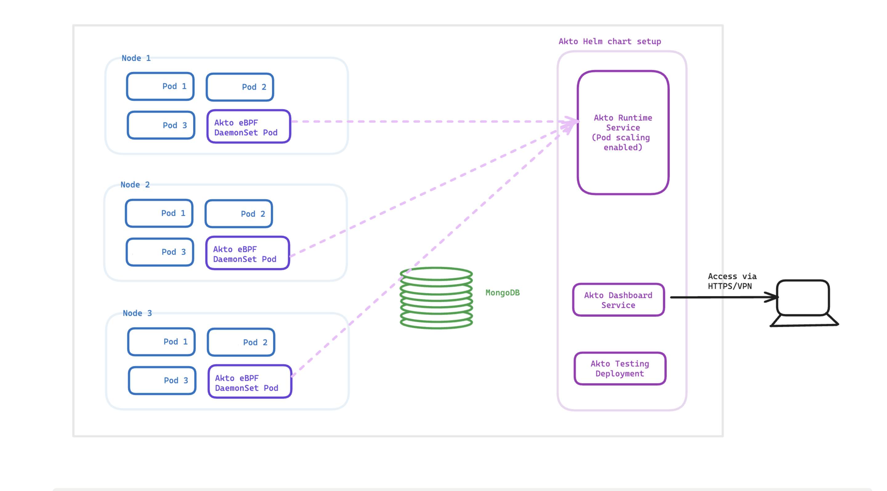

# Connect Akto with eBPF on mTLS setup

## Introduction

If your kubernetes system, has mTLS ( say using istio proxy or similar setup ) and SSL termination happens at the proxy/service, [this other setup](./ebpf.md) is recommended, please check it out. 

If your proxy/service acts as a passthrough and the SSL termination happens at the end application itself, then please continue with the current setup. 

Please note, both these setups have `different docker images`. In case of any queries, please reach out to us at `help@akto.io` .

Connecting with Akto's eBPF traffic collector is recommended mTLS systems where TLS termination occurs at application ( a system where your services are just passing the traffic directly to the application ). 

For a better understanding, here's an architecture diagram of the setup. 
<figure><figcaption><p>ebpf Deployment</p></figcaption></figure>

## Adding Akto traffic collector

1. Setup Akto data processor using the guide [here](./data-processor.md)

2. Apply the daemonset configuration given below using `kubectl apply -f akto-daemonset-config.yaml -n <NAMESPACE>`. You will find `AKTO_NLB_IP` and `AKTO_MONGO_CONN` after setting up Akto data processor, as mentioned above.

```yaml
apiVersion: apps/v1
kind: DaemonSet
metadata:
  name: akto-k8s
  namespace: {NAMESPACE}
  labels:
    app: akto-collector
spec:
  selector:
    matchLabels:
      app: akto-collector
  template:
    metadata:
      labels:
        app: akto-collector
    spec:
      hostNetwork: true
      dnsPolicy: ClusterFirstWithHostNet
      hostPID: true
      containers:
      - name: mirror-api-logging
        image: aktosecurity/mirror-api-logging:k8s_ebpf
        resources:
          limits:
            cpu: 500m
            memory: 1Gi
          requests:
            cpu: 50m
            memory: 50Mi
        env: 
          - name: AKTO_TRAFFIC_BATCH_TIME_SECS
            value: "10"
          - name: AKTO_TRAFFIC_BATCH_SIZE
            value: "100"
          - name: AKTO_KAFKA_BROKER_MAL
            value: "<AKTO_NLB_IP>:9092"
          - name: AKTO_MONGO_CONN
            value: "<AKTO_MONGO_CONN>"
        securityContext:
          capabilities:
            add:
            - SYS_PTRACE
            - SYS_ADMIN
          privileged: true
        volumeMounts:
          # needed to load kernel headers
          - name: lib-modules
            mountPath: /lib/modules
            readOnly: true
          # needed to trace kernel events
          - name: sys-kernel
            mountPath: /sys/kernel
            readOnly: true
          # needed to trace SSL user libraries
          - name: host
            mountPath: /host
            readOnly: true
      volumes:
        - name: sys-kernel
          hostPath:
            path: /sys/kernel
        - name: lib-modules
          hostPath:
            path: /lib/modules
        - name: host
          hostPath:
            path : /
```

3. You can add and configure the env variables below to control the daemonset. Here's a diagram of how the module processes traffic: 

<figure><figcaption><p>eBPF Traffic Processing</p></figcaption></figure>

```yaml
# This helps in filtering traffic sent to akto, based on certain headers. Here is an example for sending traffic only for 'bookinfo' namespace in an istio setup.
- name: AKTO_MODULE_DISCOVERY_CONFIG
  value: '[{"key":{"eq":"x-forwarded-client-cert","ifAbsent":"reject"},"value":{"regex":".*bookinfo.*"}}]'
# Time limit ( in seconds ) after which, a traffic stream is processed and marked inactive. The same stream, is not processed again.
- name: TRAFFIC_INACTIVITY_THRESHOLD
  value: "30"
# Max traffic connections kept in memory 
- name: TRAFFIC_MAX_ACTIVE_CONN
  value: "4096"
# Make this flag true to disable egress traffic. It is recommended to keep this false.
- name: TRAFFIC_DISABLE_EGRESS
  value: "false"
# Max mem usage after which the pod restarts ( in MB )
- name: AKTO_MEM_THRESH_RESTART
  value: "800"
# Max limit of traffic buffer kept in memory ( in MB )
- name: TRAFFIC_BUFFER_THRESHOLD
  value: "600"
# Ignore traffic coming from unresolved IPs, i.e. requests with host header of the format <a.b.c.d>
- name: AKTO_IGNORE_IP_TRAFFIC
  value: "false"
# Ignore traffic coming from AWS cloud metadata IP
- name: AKTO_IGNORE_CLOUD_METADATA_CALLS
  value: "false"
# The interval poll ( in seconds ) in which data is sent to Akto data processor.
- name: KAFKA_POLL_INTERVAL
  value: "0.5"
# The interval poll ( in minutes ) in which the akto module scans the current running processes, to check for new SSL related processes to probe.
- name: UPROBE_POLL_INTERVAL
  value: 5
# If you only want to trace traffic for which SSL termination happens at proxy/service.
- name: CAPTURE_ALL
  value: "false"
# If you only want to trace traffic for which SSL termination happens at application. 
# Note: when CAPTURE_ALL is false and CAPTURE_SSL is true, only application traffic is captured.
- name: CAPTURE_SSL
  value: "true"
```

4. You can check your `API inventory` on Akto dashboard to see endpoints being discovered.

## Notes:

1. If you're running the daemonset outside of the kubernetes system, set the env `PROBE_ALL_PID` as `true`.

## Frequently Asked Questions (FAQs)

**The traffic will contain a lot of sensitive data - does it leave my VPC?**

Data remains strictly within your VPC. Akto doesn't take data out of your VPC at all.

**Does adding DaemonSet have any impact on performance or latency?**

Zero impact on latency. The DaemonSet doesn't sit like a proxy. It works on eBPF technology, which works on traces function calls at kernel level. It is very lightweight. We have benchmarked it against traffic as high as 20M API requests/min. It consumes very low resources (CPU & RAM).

**I don't see my error on this list here.**

Please send us all details at support@akto.io or reach out via Intercom on your Akto dashboard. We will definitely help you out.

### Get Support for your Akto setup

There are multiple ways to request support from Akto. We are 24X7 available on the following:

1. In-app `intercom` support. Message us with your query on intercom in Akto dashboard and someone will reply.
2. Join our [discord channel](https://www.akto.io/community) for community support.
3. Contact `help@akto.io` for email support.
4. Contact us [here](https://www.akto.io/contact-us).
