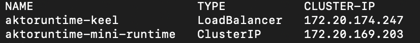
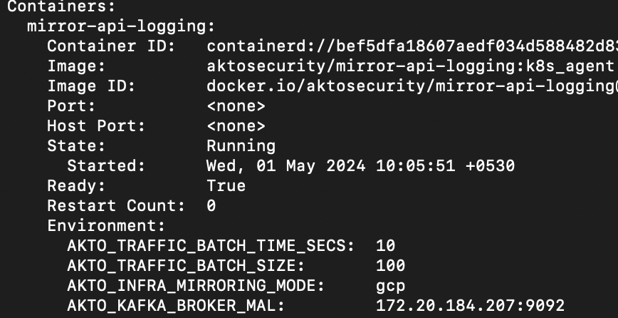

# Connect Akto with Hybrid SaaS

1\. Go to [app.akto.io](https://app.akto.io)

2\. Login/Signup into your account.

3\. Click on Quick Start tab in left nav.

<figure><figcaption></figcaption></figure>

4\. Search for Hybrid SaaS Connector and click connect.

<figure><figcaption></figcaption></figure>

### Installing Traffic connector

You can use either a CloudFormation template, Terraform template or a Helm chart to install Traffic aggregator in your env.&#x20;

#### Terraform

1. To install using Terraform, use the Terraform script [here](https://github.com/akto-api-security/infra/blob/mini\_runtime\_tf\_script/templates/mini-runtime.tf).
   1. Please make sure you install it in a private subnet from your application VPC.&#x20;
   2. This private subnet should also have network connectivity (typically via NAT).&#x20;
2. You can use `https://cyborg.akto.io` as `DatabaseAbstractorUrl` . For `DatabaseAbstractorToken` you can copy it from the helm install command in the above screenshot.&#x20;
3. Once complete, copy `akto_nlb_dns` from the output.&#x20;
4. The next step is to install a traffic connector.&#x20;
   1. You can use the above copied `AktoNLBIP` as `AKTO_KAFKA_BROKER_MAL` in your traffic connectors. Note that `AKTO_KAFKA_BROKER_MAL` is inclusive of port (eg `akto-N-.....amazonaws.com:9092`)
   2. For `AKTO_MONGO_CONN` , you can use `mongodb://0.0.0.0:27017/admini`.&#x20;

#### CloudFormation template

1. To install using CloudFormation, run the Cloudformation template [here](https://raw.githubusercontent.com/akto-api-security/infra/feature/quick-setup/templates/mini-runtime.yml).&#x20;

&#x20;     i) Please make sure you install it in a private subnet from your application VPC.&#x20;

&#x20;     ii) This private subnet should also have network connectivity (typically via NAT).&#x20;

2. You can use `https://cyborg.akto.io` as `DatabaseAbstractorUrl` . For `DatabaseAbstractorToken` you can copy it from the helm install command in the above screenshot.&#x20;
3. Once complete, go to the **Output** section of CloudFormation Stack and copy `AktoNLBIP`.&#x20;
4. The next step is to install a traffic connector.&#x20;
   1. You can use the above copied `AktoNLBIP` as `AKTO_KAFKA_BROKER_MAL` in your traffic connectors. Note that `AKTO_KAFKA_BROKER_MAL` is inclusive of port (eg `akto-N-.....amazonaws.com:9092`)
   2. For `AKTO_MONGO_CONN` , you can use `mongodb://0.0.0.0:27017/admini`.&#x20;

#### Helm chart

1. If you have K8s clusters, you can use helm chart to install Traffic aggregator. Copy helm install command by clicking on copy command button.

<figure><figcaption></figcaption></figure>

2\. Run this command in your k8s cluster, which will deploy a new Akto Traffic aggregator service.

3\. Run the below command and copy the `CLUSTER-IP` and `PORT` value for Traffic aggregator  service. In the below example it will be `172.20.169.203:9092`

```bash
kubectl get svc -n <namespace>
```

<figure><figcaption></figcaption></figure>

4\. The next step is to install a traffic connector.&#x20;

1. You can use the above copied `IP:PORT` value as `AKTO_KAFKA_BROKER_MAL` in your traffic connectors. Note that `AKTO_KAFKA_BROKER_MAL` is inclusive of port (eg `172.20.169.203:9092`)
2. For `AKTO_MONGO_CONN` , you can use `mongodb://0.0.0.0:27017/admini`.&#x20;

<figure><figcaption></figcaption></figure>

## Notes:

1. Ensure internet connectivity in Traffic aggregator  service.
2. In case of closed network, please whitelist (https://cyborg.akto.io)
3. Ensure that traffic connector is able to connect to Traffic aggregator service

## Get Support for your Akto setup

There are multiple ways to request support from Akto. We are 24X7 available on the following:

1. In-app `intercom` support. Message us with your query on intercom in Akto dashboard and someone will reply.
2. Join our [discord channel](https://www.akto.io/community) for community support.
3. Contact `help@akto.io` for email support.
4. Contact us [here](https://www.akto.io/contact-us).
