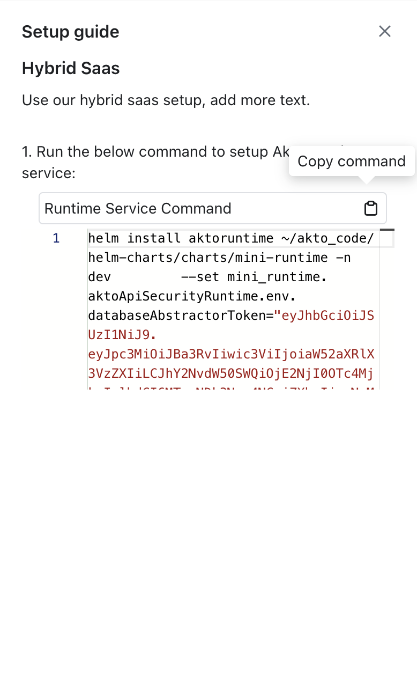
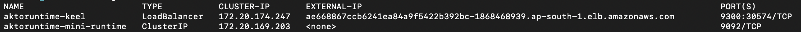

# Connect Akto with Hybrid Saas

1\. Go to https://app.akto.io/

2\. Login/Signup into your account.

3\. Click on Quick Start tab in left nav

<figure><figcaption></figcaption></figure>

4\. Search for Hybrid SaaS Connector and click on it

<figure><figcaption></figcaption></figure>

5\. Copy the provided helm install command by clicking on Copy Command button

<figure><figcaption></figcaption></figure>

6\. Run this command in your cloud, which will deploy a new Akto mini-runtime service

7\. Run kubectl get svc -n <namespace> and copy the CLUSTER-IP and PORT value for mini-runtime service. For ex - in the below example it will be 172.20.169.203:9092

<figure><figcaption></figcaption></figure>

8\. Modify the above copied ip:port value in variable (AKTO_KAFKA_BROKER_MAL) while deploying your traffic connector.
