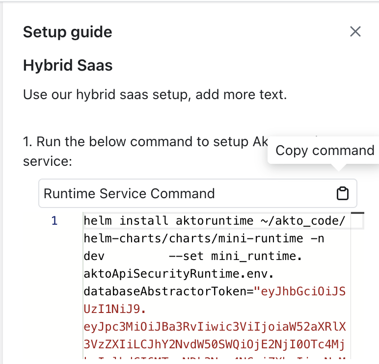

# Connect Akto with Hybrid Saas

1\. Go to [app.akto.io](https://app.akto.io)

2\. Login/Signup into your account.

3\. Click on Quick Start tab in left nav.

<figure><figcaption></figcaption></figure>

4\. Search for Hybrid SaaS Connector and click connect.

<figure><figcaption></figcaption></figure>

5\. Copy the provided helm install command by clicking on copy command button.

<figure><figcaption></figcaption></figure>

6\. Run this command in your k8s cluster, which will deploy a new Akto mini-runtime service. 

7\. Run the below command and copy the `CLUSTER-IP` and `PORT` value for mini-runtime service. In the below example it will be `172.20.169.203:9092`

```bash
kubectl get svc -n <namespace>
```

<figure><figcaption></figcaption></figure>

8\. Modify the above copied `IP:PORT` value in the env. variable (`AKTO_KAFKA_BROKER_MAL`) while deploying your traffic connector. 

<figure><figcaption></figcaption></figure>

## Notes: 

1. Ensure internet connectivity in Mini-Runtime service.
2. In case of closed network, please whitelist (https://aquaman.akto.io)
3. Ensure that traffic connector is able to connect to Mini-Runtime service


## Get Support for your Akto setup

There are multiple ways to request support from Akto. We are 24X7 available on the following:

1. In-app `intercom` support. Message us with your query on intercom in Akto dashboard and someone will reply.
2. Join our [discord channel](https://www.akto.io/community) for community support.
3. Contact `help@akto.io` for email support.
4. Contact us [here](https://www.akto.io/contact-us).
