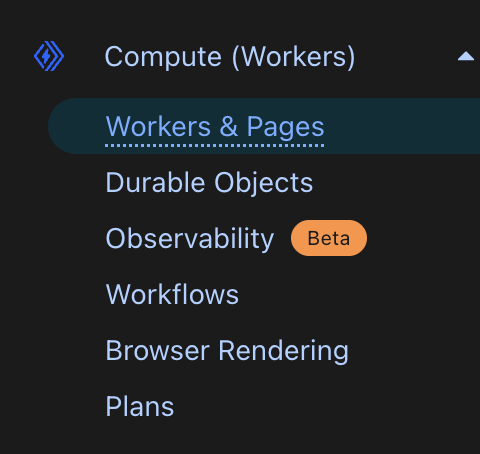
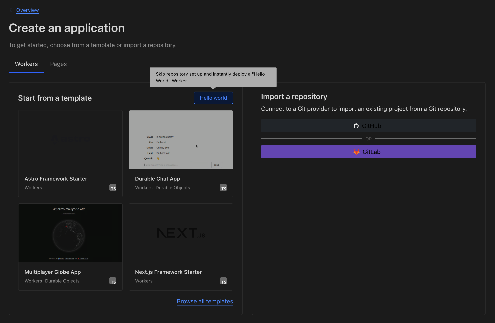
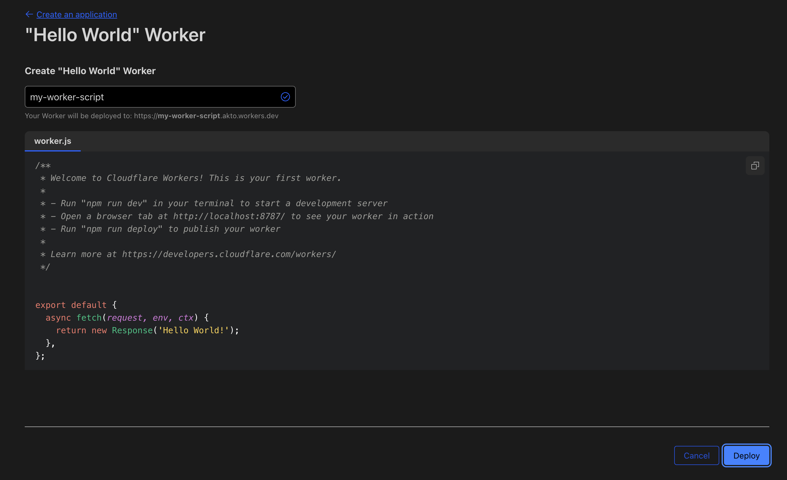

# Connect Akto Guardrails with Cloudflare Worker Proxy

Cloudflare sits in front of your APIs at the edge. This integration uses a Cloudflare Worker that does two things: it **mirrors** traffic into Akto for discovery and inventory (same idea as the standard Akto Cloudflare proxy), and it optionally **enforces Akto Guardrails** on selected HTTP traffic before and after your origin. That lets you validate and, when needed, block or rewrite agentic and Gen AI–style API calls while still feeding Akto’s data ingestion pipeline.

<figure><figcaption></figcaption></figure>

Akto provides the **Guardrails service URL** and the **data ingestion base URL** you configure on the Worker. Use the steps below to deploy the Worker and attach it to your zones.

---

## Step 1: Deploy the Guardrails Worker

Use the Worker script from Akto’s published source:

**Worker code:** 
https://raw.githubusercontent.com/akto-api-security/infra/refs/heads/feature/quick-setup/akto-cloudflare-proxy-guardrails/src/index.js

Deploy using the Cloudflare dashboard and the steps below.

### Dashboard path (high level)

1. Open the [Cloudflare Dashboard](https://dash.cloudflare.com/) and select your account.
2. Go to **Workers & Pages**.
3. Create a **Worker** (you can start from the Hello World template, deploy once, then **Edit code**).
4. Replace the editor contents with the full script from the link above.
5. Save and deploy.

<figure><figcaption></figcaption></figure>

<figure><figcaption></figcaption></figure>

<figure><figcaption></figcaption></figure>

### What this Worker does (so you can verify your deployment)

- **WebSocket upgrades** are proxied as-is. The Worker logs metadata suitable for mirroring; it does not run Guardrails body validation on the upgrade handshake in the same way as full HTTP bodies.
- **HTTP(S)**  
  - If Guardrails are **off** (see variables below), behavior is essentially **mirror-only**: request and response streams are teed where needed, the client still talks to your origin normally, and eligible traffic is sent to Akto ingestion.  
  - If Guardrails are **on** for a given request, the Worker:
    1. After reading the request body (when present), calls Guardrails for the **request** phase. If the policy **blocks**, the client receives HTTP **400** with a small JSON error payload (including a reason when the service provides one). If the policy **modifies** the payload, the upstream request uses the modified body.
    2. After receiving the origin response and reading the response body (when present), calls Guardrails for the **response** phase. Again, **block** yields **400** to the client; **modify** replaces the body returned to the client.
    3. Regardless of block/modify/proceed, mirroring to Akto ingestion follows the same content-type and status rules as the simpler proxy Worker.

**Guardrails are not applied** to `GET` or `DELETE` requests (those methods are always treated as mirror-only from a Guardrails perspective).

**Path scoping:** When Guardrails are enabled globally, you can limit which paths are validated by setting a comma-separated list of path **fragments** (the Worker matches them as substrings of the URL path, case-insensitive, after normalizing leading slashes). If that list is unset or empty, all non–GET/DELETE methods are candidates for Guardrails (subject to the enable flag).

**Ingestion payload tagging:** Mirrored entries are tagged so Akto can treat them as Gen AI–related traffic (`tag` includes `service: cloudflare` and a Gen AI marker).

---

### Environment variables and secrets

Configure these in the Worker’s **Settings → Variables** (plain vars) and **Secrets** (sensitive values). Use the **Guardrails URL**, **data ingestion URL**, and **ingestion token** supplied by Akto.

| Name | Purpose |
|------|--------|
| `APPLY_AKTO_GUARDRAILS` | Set to `true` or `1` (string or boolean) to enable request/response Guardrails for applicable methods and paths. Any other value disables Guardrails while keeping mirroring. |
| `AKTO_GUARDRAILS_URL` | Base URL of the Guardrails service (Akto-provided), **no trailing slash**. Required for validation calls; if missing, the Worker skips Guardrails and only mirrors. |
| `AKTO_ENDPOINTS_TO_GUARD` | Optional. Comma-separated path fragments; if non-empty, Guardrails run only when the request path contains one of these fragments (after lowercasing). If empty, all eligible methods/paths (except GET/DELETE) are guarded when Guardrails are on. |
| `AKTO_DATA_INGESTION_URL` | Base URL of the Akto data-ingestion host (Akto-provided), **no trailing slash**. The Worker appends `/api/ingestData`. If this or the token is missing, ingest calls are skipped (logged in Worker logs). |
| `AKTO_DATA_INGESTION_TOKEN` | Secret sent as the **`Authorization`** header on ingest POSTs. Add it under **Settings → Variables and Secrets** as a **Secret**. You can copy the value from **Akto Dashboard → Quick Setup → Hybrid SaaS** as `databaseAbstractorToken`. |

---

## Step 2: Configure Worker Routing

Attach the Worker to the hostnames and paths that should pass through Akto mirroring (and Guardrails when enabled):

1. In Cloudflare, open **Workers & Pages** → your Worker → **Settings** → **Domains & Routes**.
2. **Add route** and pick the zone; use a pattern that covers your APIs, for example:

   ```
   *.yourdomain.com/*
   ```

Traffic matching the route is handled by this Worker; everything else is unchanged.

---

## Step 3: Verify the setup

1. **Ingestion:** Generate API traffic on a routed hostname. In **Akto Dashboard → API Collections** (e.g. by hostname), confirm new endpoints and traffic appear as with the standard Cloudflare proxy connector.
2. **Guardrails:** With `APPLY_AKTO_GUARDRAILS` enabled, exercise a **POST** or **PUT** (or other non-GET/DELETE) path that should be guarded. Confirm allowed traffic still reaches your origin; intentionally trigger a policy that **blocks** and confirm the client receives **400** with the JSON error shape; if your policies **modify** payloads, confirm the client sees the rewritten body.
3. **Worker logs:** In **Workers & Pages → your Worker → Logs**, look for guardrails phase logs, ingest success/failure, and any warnings about missing `AKTO_GUARDRAILS_URL` or ingest URL/token.

---

### Get support for your Akto setup

1. In-app **Intercom** in the Akto dashboard.
2. [Discord community](https://www.akto.io/community).
3. Email **help@akto.io**.
4. [Contact Akto](https://www.akto.io/contact-us).
