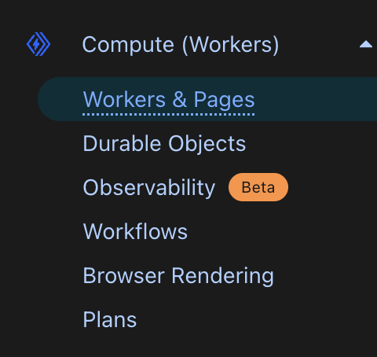
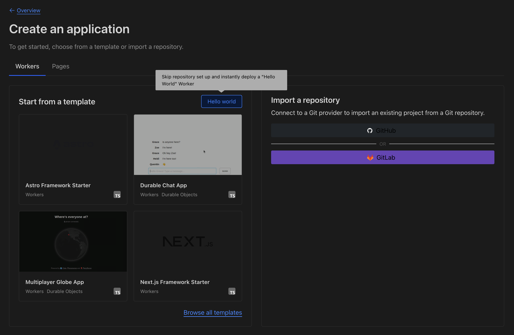
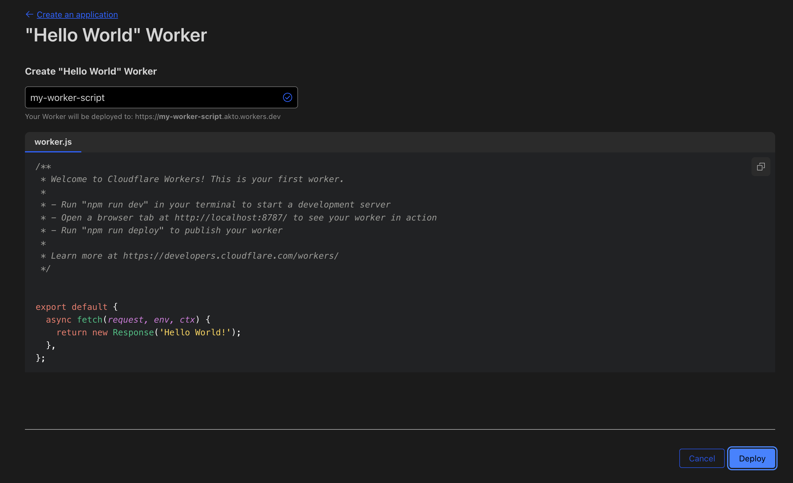

# Connect Akto with Cloudflare Container

(Traffic Connector Worker on CloudFlare sending traffic data to IngestData API in CloudFlare Container to enable API discovery)

Cloudflare is a global network security platform that provides CDN, DDoS protection, and API security services. Integrating Cloudflare with Akto will enable automatic discovery of all APIs passing through your Cloudflare infrastructure, helping you maintain continuous visibility and protection of your edge-distributed APIs.

<figure><figcaption></figcaption></figure>

To connect Akto with Cloudflare, follow these steps -

## Step 1: Deploy the Akto Mini-Runtime-Service as Cloudflare Container

Before configuring the Cloudflare Worker Traffic Connector, you need to deploy the Akto Mini-Runtime Service.

1. The **Akto-Mini-Runtime-Service** is a container that runs on Cloudflare and is responsible for receiving traffic logs from the Cloudflare Worker.
2. Configure image name of Akto Mini-Runtime Service.

#### Pre-requisites

1. Make Cloudflare Account . Buy **Workers Paid Plan** to deploy containers through worker.
2. Go to terminal of your system and configure to access cloud flare account by exporting cloud flare API token.
3. You need to create Account API Token by visiting `https://dash.cloudflare.com/<ID>/api-tokens`
4. **Create token with below permissions** : Containers:Edit, Queues:Edit, Workers R2 Storage:Edit, Workers Tail:Read, Workers KV Storage:Edit, Workers Scripts:Edit, Workers Scripts:Read, Account Settings:Read

### Container deployment

1. Create `wrangler.jsonc` file with these contents -

```
{
    "name": "akto-mini-runtime-1",
    "account_id": "your id",
    "compatibility_date": "2025-07-11",
    "container": {
        "image": "mrs:testing"
    }
}

```

2. Push Akto container to your registry (steps mentioned on[ Cloudflare docs](https://developers.cloudflare.com/containers/platform-details/image-management/))

```
docker pull --platform linux/amd64 aktosecurity/mini-runtime-service:latest
docker tag aktosecurity/mini-runtime-service:latest mrs:testing
wrangler containers push mrs:testing
```

3. Confirm the image on cloudflare registry. You will see similar below output :

Login Succeeded The push refers to repository \[registry.cloudflare.com/\<ID>/akto-mini-runtime]

This is the path of image to be configured in wrangler.jsonc - registry.cloudflare.com/\<ID>/akto-mini-runtime:latest

### Deploy Akto Traffic Collector (worker)

1. Create a new Cloudflare project.
2. In `wrangler.jsonc` file of the workder, add the docker image address

```javascript

     "containers": [
                {
                        "class_name": "MyContainer",
                        "image": "registry.cloudflare.com/<ID>/mrs:testing",
                        "max_instances": 10,
                        "instance_type": "standard", // you might need bigger instances here
                        "name": "hello-containers"
                }
        ]
        
```

2. Below changes in src/index.ts to connect the Akto Mini-Runtime Service with Cloudflare Worker and to call the API endpoint in the docker image.

```javascript
import { Container, loadBalance, getContainer, getRandom } from "@cloudflare/containers";
import { Hono } from "hono";

const INSTANCE_COUNT = 1;

export class MyContainer extends Container {
  // Port the container listens on (default: 8080)
  defaultPort = 8080;
  // Time before container sleeps due to inactivity (default: 30s)
  sleepAfter = "24h";
  // Environment variables passed to the container
  envVars = {
    MESSAGE: "I was passed in via the container class!",
    AKTO_LOG_LEVEL: "DEBUG",
    DATABASE_ABSTRACTOR_SERVICE_TOKEN: "<your-database-abstractor-service-token>",
    AKTO_TRAFFIC_QUEUE_THRESHOLD: "100",
    AKTO_INACTIVE_QUEUE_PROCESSING_TIME: "5000",
    AKTO_TRAFFIC_PROCESSING_JOB_INTERVAL: "10",
    AKTO_CONFIG_NAME: "STAGING",
    RUNTIME_MODE: "HYBRID"
  };

  

  // Optional lifecycle hooks
  override onStart() {
    console.log("Container successfully started");
  }

  override onStop() {
    console.log("Container successfully shut down");
  }

  override onError(error: unknown) {
    console.log("Container error:", error);
  }

}

// Create Hono app with proper typing for Cloudflare Workers
const app = new Hono<{
  Bindings: { MY_CONTAINER: DurableObjectNamespace<MyContainer> };
}>();

// Home route with available endpoints
app.get("/", (c) => {
  return c.text(
    "Available endpoints:\n" +
      "GET /container/<ID> - Start a container for each ID with a 2m timeout\n" +
      "GET /lb - Load balance requests over multiple containers\n" +
      "GET /error - Start a container that errors (demonstrates error handling)\n" +
      "GET /singleton - Get a single specific container instance",
  );
});

// Route requests to a specific container using the container ID
app.get("/container/:id", async (c) => {
  const id = c.req.param("id");
  const containerId = c.env.MY_CONTAINER.idFromName(`/container/${id}`);
  const container = c.env.MY_CONTAINER.get(containerId);
  return await container.fetch(c.req.raw);
});

// Demonstrate error handling - this route forces a panic in the container
app.get("/error", async (c) => {
  const container = getContainer(c.env.MY_CONTAINER, "error-test");
  return await container.fetch(c.req.raw);
});

// Load balance requests across multiple containers
app.get("/lb", async (c) => {
  const container = await loadBalance(c.env.MY_CONTAINER, 3);
  return await container.fetch(c.req.raw);
});

// Get a single container instance (singleton pattern)
app.post("/api/ingestData", async (c) => {

  //const id = 1;
  const containerInstance = getRandom(c.env.MY_CONTAINER, INSTANCE_COUNT);
  const containerId = c.env.MY_CONTAINER.idFromName(`/container/${containerInstance}`);
  const container = c.env.MY_CONTAINER.get(containerId);

  
  return await container.fetch(c.req.raw);

});


export default app;

```

***

`/api/ingestData` - Is the endpoint in our docker image to be called from container in cloud flare

3. Now deploy container to cloud flare with command - **wrangler deploy**

```bash
After successful deployment, you will see the URL of your deployed container in the terminal output. It will look something like this:
https://super-resonance-827f.billing-53a.workers.dev
```

***

## Step 2: Set Up Your Cloudflare Worker Script

1. Navigate to the [Cloudflare Dashboard](https://dash.cloudflare.com/) and select your account.
2.  Go to **Workers & Pages**.

    <figure><figcaption></figcaption></figure>
3.  Click **Create** and choose **Worker**.

    <figure><figcaption></figcaption></figure>
4.  Click the **Hello World** button and deploy it.

    <figure><figcaption></figcaption></figure>
5. Click **Edit code** and replace the default script with the following example:

```javascript
export default {
  async fetch(request, env, ctx) {
    const [reqForFetch, reqForCollector] = await duplicateRequest(request); // At the starting of your fetch method
    const backendResponse = await fetch(reqForFetch);
    return collectTraffic(reqForCollector, backendResponse, env, ctx); // just after getting response
  },
};

async function duplicateRequest(request) {
  if (!request.body) {
    return [request, request.clone()];
  }
  const [stream1, stream2] = request.body.tee();
  const req1 = new Request(request, { body: stream1 });
  const req2 = new Request(request, { body: stream2 });
  return [req1, req2];
}

function collectTraffic(request, backendResponse, env, ctx, extra) {
  const contentType = (request.headers.get("content-type") || "").toLowerCase();
  const isAllowed = isAllowedContentType(contentType);
  const shouldCapture = isAllowed && isValidStatus(backendResponse.status);

  if (!shouldCapture) return backendResponse;

  // Split response stream
  let responseForClient = backendResponse;
  let responseForLogging = null;

  if (backendResponse.body) {
    const [respStream1, respStream2] = backendResponse.body.tee();

    // Return one response to client
    responseForClient = new Response(respStream1, {
      headers: backendResponse.headers,
      status: backendResponse.status,
      statusText: backendResponse.statusText
    });

    // Keep the other for logging
    responseForLogging = respStream2;
  }

  ctx.waitUntil((async () => {
    let requestBody = "";
    if (request.body) requestBody = await streamToString(request.body);
    let responseBody = "";
    if (responseForLogging) responseBody = await streamToString(responseForLogging);
    await sendToAkto(request, requestBody, backendResponse, responseBody, env, extra);
  })());

  return responseForClient;
}

function isAllowedContentType(contentType) {
  const allowedTypes = [
    "application/json",
    "application/xml",
    "text/xml",
    "application/grpc",
    "application/x-www-form-urlencoded",
    "application/soap+xml"
  ];
  return allowedTypes.some(type => contentType.includes(type));
}

function isValidStatus(status) {
  return (status >= 200 && status < 300) || [301, 302, 304].includes(status);
}

async function streamToString(stream) {
  const reader = stream.getReader();
  const decoder = new TextDecoder();
  let result = "";
  while (true) {
    const { done, value } = await reader.read();
    if (done) break;
    result += decoder.decode(value, { stream: true });
  }
  return result;
}

async function sendToAkto(request, requestBody, response, responseBody, env, extra) {
  const aktoAPI = "https://<your-ingestion-service-address>/api/ingestData";
  const logs = generateLog(request, requestBody, response, responseBody, extra);
  const aktoRequest = new Request(aktoAPI, {
    method: "POST",
    body: logs,
    headers: { "Content-Type": "application/json", "x-api-key": "<YOUR_AKTO_API_KEY>" },
  });
  const aktoResponse = await env.data_injection_worker.fetch(aktoRequest);
  if (aktoResponse.status === 400) {
    console.error(`Akto response: ${aktoResponse.status} ${aktoResponse.statusText}, Body: ${await aktoResponse.text()}`);
  }
}

function getStatusText(statusCode) {
  const statusTexts = {
    100: "Continue",
    101: "Switching Protocols",
    200: "OK",
    201: "Created",
    202: "Accepted",
    203: "Non-Authoritative Information",
    204: "No Content",
    205: "Reset Content",
    206: "Partial Content",
    300: "Multiple Choices",
    301: "Moved Permanently",
    302: "Found",
    303: "See Other",
    304: "Not Modified",
    307: "Temporary Redirect",
    308: "Permanent Redirect",
    400: "Bad Request",
    401: "Unauthorized",
    402: "Payment Required",
    403: "Forbidden",
    404: "Not Found",
    405: "Method Not Allowed",
    406: "Not Acceptable",
    407: "Proxy Authentication Required",
    408: "Request Timeout",
    409: "Conflict",
    410: "Gone",
    411: "Length Required",
    412: "Precondition Failed",
    413: "Payload Too Large",
    414: "URI Too Long",
    415: "Unsupported Media Type",
    416: "Range Not Satisfiable",
    417: "Expectation Failed",
    422: "Unprocessable Entity",
    429: "Too Many Requests",
    500: "Internal Server Error",
    501: "Not Implemented",
    502: "Bad Gateway",
    503: "Service Unavailable",
    504: "Gateway Timeout",
    505: "HTTP Version Not Supported",
  };
  return statusTexts[statusCode] || "Unknown";
}

function generateLog(req, requestBody, res, responseBody, extra) {
  const url = new URL(req.url);
  const statusText = res.statusText || getStatusText(res.status);
  const value = {
    path: url.pathname + url.search,
    requestHeaders: JSON.stringify(Object.fromEntries(req.headers)),
    responseHeaders: JSON.stringify(Object.fromEntries(res.headers)),
    method: req.method,
    requestPayload: requestBody,
    responsePayload: responseBody,
    ip: req.headers.get("x-forwarded-for") || req.headers.get("cf-connecting-ip") || req.headers.get("x-real-ip") || "",
    time: Math.round(Date.now() / 1000).toString(),
    statusCode: res.status.toString(),
    type: "HTTP/1.1",
    status: statusText,
    akto_account_id: "1000000",
    akto_vxlan_id: "0",
    is_pending: "false",
    source: "MIRRORING",
    tag: "{\n  \"service\": \"cloudflare\"\n}"
  };

  // ONLY add parentMcpToolNames if it exists and is not empty
  if (extra?.parentMcpToolNames && extra?.parentMcpToolNames.length > 0) {
    value.parentMcpToolNames = extra.parentMcpToolNames;
    console.log(`Added parentMcpToolNames to log: ${JSON.stringify(extra.parentMcpToolNames)}`);
  } else {
    console.log("No parentMcpToolNames - this is MCP traffic (not from inside a tool)");
  }

  return JSON.stringify({ batchData: [value] });
}
```

***

### Capturing MCP Server Traffic

If you're using this integration to collect MCP server traffic, you can also capture both the MCP tool calls and the API calls being made inside them. This allows you to map the relationship between MCP tools and their underlying API calls in the Akto dashboard.

To enable this functionality, add the following lines around your MCP tool's fetch function:

```javascript
const [reqForFetch, reqForCollector] = await duplicateRequest(request); // At the starting of your mcp tool fetch method
const backendResponse = await fetch(reqForFetch);
const responseForClient = collectTraffic(reqForCollector, backendResponse, env, ctx); // add this line just after getting response
```

***

## Step 3: Configure Worker Routing with Service Binding

To securely connect your client Worker (e.g., mcp worker) with the Akto Mini-Runtime-Service Container, use **service binding**. This allows your Worker to call the container Worker internally, without exposing it to the public internet.

### 1. Add Service Binding to Your Client Worker

1. In the Cloudflare Dashboard, go to **Workers & Pages**.
2. Under **Overview**, select your client Worker (e.g., mcp worker).
3. Navigate to **Settings** > **Bindings**.
4. Click **Add binding** and select **Service binding**.
5.  In the **Variable name** field, enter:

    ```
    data_injection_worker
    ```
6. In **Service binding**, select the container Worker you created in Step 1.
7. In **Entrypoint**, select the container's Durable Object name.
8. Click **Add** and then **Deploy** your Worker.

### 2. Restrict Container Worker to Internal Network

1. Go to the container Worker in the Cloudflare Dashboard.
2. Click **Settings**.
3. Navigate to **Domains & Routes**.
4. Disable both **workers.dev** and **Preview URLs**.

This ensures your container Worker is only accessible internally via service binding, improving security.

### 3. Add Service Binding via `wrangler.toml` or `wrangler.json`

Instead of using the Dashboard, you can also define the binding directly in your configuration file:

**`wrangler.toml`:**

```toml
...
services = [
  { binding = "<BINDING_NAME>", service = "<WORKER_NAME>" }
]
...
```

**`wrangler.json`:**

```json
{
  ...
  "services": [
    {
      "binding": "<BINDING_NAME>",
      "service": "<WORKER_NAME>"
    }
  ]
  ...
}
```

This approach lets you manage service bindings as code, making deployments reproducible and easier to version control.

***

Now, your client Worker can securely communicate with the Akto Mini-Runtime-Service Container using the `data_injection_worker` binding, and your container Worker is not exposed

***

## Step 4: Verify the Setup

1. Confirm that API traffic data (requests and responses) are captured on the Akto dashboard under the respective api collection.
2. Check logs of your Cloudflare container for any initialization messages from the extension.
3. Go back to the [Akto Dashboard](https://app.akto.io/).
4. Navigate to **Api Collections** > **Hostname**.
5. You should start seeing the traffic from your Cloudflare Worker.

***

### Get Support for your Akto setup

There are multiple ways to request support from Akto. We are 24X7 available on the following:

1. In-app `intercom` support. Message us with your query on intercom in Akto dashboard and someone will reply.
2. Join our [discord channel](https://www.akto.io/community) for community support.
3. Contact `help@akto.io` for email support.
4. Contact us [here](https://www.akto.io/contact-us).
