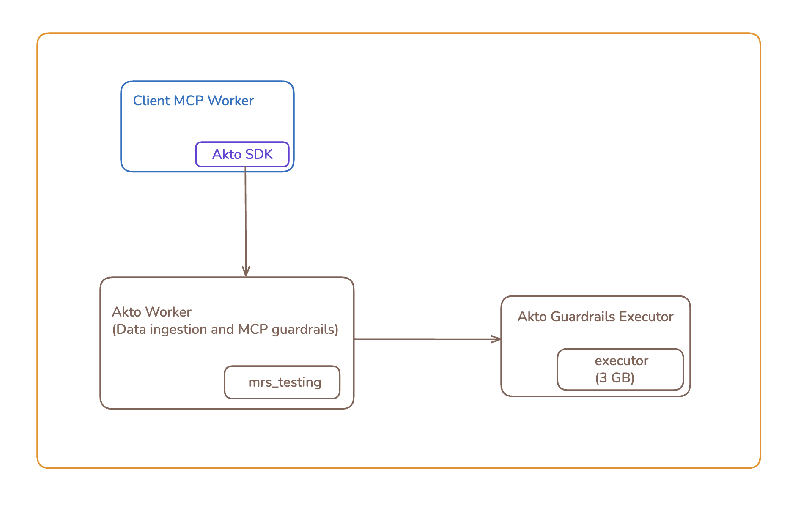

# Connect Akto with Cloudflare

Cloudflare is a global network security platform that provides CDN, DDoS protection, and API security services. Integrating Cloudflare with Akto will enable automatic discovery of all APIs passing through your Cloudflare infrastructure, helping you maintain continuous visibility and protection of your edge-distributed APIs.

<figure><figcaption></figcaption></figure>

## Purpose

Connect your Cloudflare web application / MCP server to Akto for:
- **Traffic data ingestion** - Automatic API discovery and monitoring
- **MCP Guardrails** - Real-time security scanning and threat detection for AI agent interactions

## Quick Navigation

- [Deployment Options](#deployment-options)
- [Architecture Diagram](#architecture-mcp-guardrails-and-data-ingestion)
- [Worker Deployment: akto-guardrails-executor](#worker-deployment-akto-guardrails-executor)
- [Worker Deployment: akto-ingest-guardrails](#worker-deployment-akto-ingest-guardrails)
- [Updating Your Server Code: akto-ingestion-publisher](#updating-your-server-code-akto-ingestion-publisher)
- [Verification Steps](#verification-steps)
- [Get Support](#get-support)

## Deployment Options

Choose the deployment path that fits your needs:

### Option 1: Data Ingestion Only (Without Guardrails)

If you only need API discovery and monitoring without MCP guardrails:

1. **[Deploy akto-ingest-guardrails Worker](#worker-deployment-akto-ingest-guardrails)** (set `ENABLE_MCP_GUARDRAILS` to `false`)
2. **[Update Your Server Code](#updating-your-server-code-akto-ingestion-publisher)** to enable traffic collection

### Option 2: Data Ingestion with MCP Guardrails

If you need both API discovery and real-time MCP security guardrails:

1. **[Deploy akto-guardrails-executor Worker](#worker-deployment-akto-guardrails-executor)** - Executes guardrail policies
2. **[Deploy akto-ingest-guardrails Worker](#worker-deployment-akto-ingest-guardrails)** - Orchestrates ingestion and guardrails (set `ENABLE_MCP_GUARDRAILS` to `true`)
3. **[Update Your Server Code](#updating-your-server-code-akto-ingestion-publisher)** to enable traffic collection

***

## Architecture

### Data Ingestion Only

This diagram shows the architecture for **Option 1** - data ingestion without MCP guardrails. Your Cloudflare Worker collects traffic data and sends it to the Akto Ingest-Guardrails Worker (with `ENABLE_MCP_GUARDRAILS=false`), which then forwards the data to Akto for API discovery and monitoring.

<figure><figcaption><p>Data Ingestion Only Architecture</p></figcaption></figure>

### Data Ingestion with MCP Guardrails

This diagram shows the architecture for **Option 2** - data ingestion with MCP guardrails enabled. Your Cloudflare Worker sends traffic to the Akto Ingest-Guardrails Worker (with `ENABLE_MCP_GUARDRAILS=true`), which coordinates with the Akto Guardrails Executor to enforce security policies before sending data to Akto.

<figure><figcaption><p>Data Ingestion with MCP Guardrails Architecture</p></figcaption></figure>

***

## Worker Deployment Details

### Worker Deployment: akto-guardrails-executor

The Agent Guard Executor service is **required only for MCP Guardrails**. Skip this section if you only need data ingestion without guardrails.

The MCP Guardrails Worker will communicate with this service via Cloudflare worker-to-worker binding to execute guardrail policies.

#### Prerequisites

- Docker with buildx
- Node.js 18+
- Wrangler CLI authenticated with your Cloudflare account

#### 1. Checkout Worker Code

Clone the worker code from the repository:

```bash
# Clone the Akto Cloudflare deployments repository
git clone https://github.com/akto-api-security/akto-cloudflare-deployments.git
cd akto-cloudflare-deployments

# Switch to the ingestion-and-guardrails branch
git checkout feature/ingestion-and-guardrails

# Pull the latest changes to ensure you have the most recent version
git pull origin feature/ingestion-and-guardrails

# Navigate to the guardrails executor worker directory
cd workers/akto-guardrails-executor
```

Alternatively, download and extract the zip file:

```bash
# Download the repository as a zip file
curl -L -o akto-cloudflare-deployments.zip https://github.com/akto-api-security/akto-cloudflare-deployments/archive/refs/heads/feature/ingestion-and-guardrails.zip

# Extract the zip file
unzip akto-cloudflare-deployments.zip

# Navigate to the guardrails executor worker directory
cd akto-cloudflare-deployments-feature-ingestion-and-guardrails/workers/akto-guardrails-executor
```

#### 2. Install Dependencies

```bash
npm install
```

#### 3. Pull and Push Agent Guard Executor Container Image

Pull, rebuild, and push the Agent Guard Executor container image to Cloudflare registry:

```bash
# Pull the image
docker pull --platform linux/amd64 public.ecr.aws/aktosecurity/akto-agent-guard-executor:1.12.1_local

# Rebuild for linux/amd64 (required)
docker buildx build --platform linux/amd64 --load -t agent-guard-executor:testing - <<'EOF'
FROM public.ecr.aws/aktosecurity/akto-agent-guard-executor:1.12.1_local
EOF

# Push to Cloudflare registry
npx wrangler containers push agent-guard-executor:testing
```

#### 4. Configure Worker

Update the `wrangler.jsonc` file in the `akto-guardrails-executor` directory. Replace the image path with your Cloudflare registry URL:

```json
"image": "registry.cloudflare.com/<YOUR_CLOUDFLARE_ACCOUNT_ID>/agent-guard-executor:testing"
```

#### 5. Deploy Worker

```bash
npx wrangler deploy
```

After deploying the Agent Guard Executor Worker, note its worker name - you'll use it to configure the worker-to-worker service binding in the next section.

***

### Worker Deployment: akto-ingest-guardrails

The Akto Ingest-Guardrails Worker is **required for both deployment options**:
- **Data Ingestion Only**: Set `ENABLE_MCP_GUARDRAILS` to `false`
- **Data Ingestion with Guardrails**: Set `ENABLE_MCP_GUARDRAILS` to `true` (requires akto-guardrails-executor deployed first)

This worker handles traffic data ingestion to Akto and optionally orchestrates MCP guardrail enforcement based on configured policies.

#### Prerequisites

- Node.js 18+
- Wrangler CLI authenticated with your Cloudflare account
- Docker with buildx
- If enabling guardrails: akto-guardrails-executor Worker deployed (see previous section)

#### 1. Checkout Worker Code

If you cloned the repository in the previous section:

```bash
# Navigate to the ingest-guardrails worker directory from the repository root
cd akto-cloudflare-deployments/workers/akto-ingest-guardrails
```

If you downloaded the zip file in the previous section:

```bash
# Navigate to the ingest-guardrails worker directory from the extracted folder
cd akto-cloudflare-deployments-feature-ingestion-and-guardrails/workers/akto-ingest-guardrails
```

If you haven't cloned or downloaded yet, use one of these options:

**Option A: Clone the repository**

```bash
# Clone the Akto Cloudflare deployments repository
git clone https://github.com/akto-api-security/akto-cloudflare-deployments.git
cd akto-cloudflare-deployments

# Switch to the ingestion-and-guardrails branch
git checkout feature/ingestion-and-guardrails

# Pull the latest changes to ensure you have the most recent version
git pull origin feature/ingestion-and-guardrails

# Navigate to the ingest-guardrails worker directory
cd workers/akto-ingest-guardrails
```

**Option B: Download and extract the zip file**

```bash
# Download the repository as a zip file
curl -L -o akto-cloudflare-deployments.zip https://github.com/akto-api-security/akto-cloudflare-deployments/archive/refs/heads/feature/ingestion-and-guardrails.zip

# Extract the zip file
unzip akto-cloudflare-deployments.zip

# Navigate to the ingest-guardrails worker directory
cd akto-cloudflare-deployments-feature-ingestion-and-guardrails/workers/akto-ingest-guardrails
```

#### 2. Install Dependencies

```bash
npm install
```

#### 3. Push Mini Runtime Service Container Image

Pull, rebuild, and push the Mini Runtime Service container image:

```bash
# Pull the image
docker pull --platform linux/amd64 aktosecurity/mini-runtime-service:latest

# Rebuild for linux/amd64 (required)
docker buildx build --platform linux/amd64 --load -t mrs:testing - <<'EOF'
FROM aktosecurity/mini-runtime-service:latest
EOF

# Push to Cloudflare registry
npx wrangler containers push mrs:testing
```

#### 4. Configure Worker

Update the `wrangler.jsonc` file:

1. Set the container image path with your Cloudflare account ID:
   ```json
   "image": "registry.cloudflare.com/<YOUR_CLOUDFLARE_ACCOUNT_ID>/mrs:testing"
   ```

2. Configure the `ENABLE_MCP_GUARDRAILS` environment variable:
   - **For data ingestion only (Option 1)**: Set to `"false"`
   - **For data ingestion with guardrails (Option 2)**: Set to `"true"`

   ```json
   "vars": {
     "ENABLE_MCP_GUARDRAILS": "false"
   }
   ```

3. **If enabling guardrails** (Option 2): Configure service bindings to connect with the Agent Guard Executor Worker deployed in the previous section.

#### 5. Set Secrets

Set the required secrets for the worker:

```bash
npx wrangler secret put DATABASE_ABSTRACTOR_SERVICE_TOKEN
npx wrangler secret put THREAT_BACKEND_TOKEN
```

**Environment Variables:**
- `DATABASE_ABSTRACTOR_SERVICE_URL`: "https://cyborg.akto.io"
- `THREAT_BACKEND_URL`: "https://tbs.akto.io"
- `ENABLE_MCP_GUARDRAILS`: "true" (set to "false" for ingestion-only deployment)

#### 6. Deploy Worker

```bash
npx wrangler deploy
```

**Important Notes:**
- This worker is private and does not expose a public HTTP URL
- Worker-to-worker binding enables secure communication with the Agent Guard Executor Worker (if guardrails enabled)
- The worker orchestrates guardrail checks based on your configured security and audit policies (if guardrails enabled)

***

### Updating Your Server Code: akto-ingestion-publisher

After deploying the `akto-ingest-guardrails` worker, you need to update your Cloudflare server code to enable traffic data collection and send it to Akto.

#### Integration Guide

##### 1. Copy the Akto Integration Code

Reference the example worker from the [akto-ingestion-publisher](https://github.com/akto-api-security/akto-cloudflare-deployments/tree/feature/ingestion-and-guardrails/workers/akto-ingestion-publisher) directory and copy the `src/akto/` folder to your project. This directory contains:

- `ingest-data.ts` - Main ingestion entry point
- `akto-ingestion-client.ts` - Singleton client for Akto service communication
- `models.ts` - Data models and payload builder
- `validations.ts` - Traffic capture validation logic
- `utils.ts` - Contains utilities for traffic ingestion to Akto

##### 2. Update Your Worker's Fetch Handler

```typescript
import { replicateRequest, replicateResponse } from "./akto/utils";
import { ingestTrafficToAkto } from "./akto/ingest-data";
import { AktoIngestionClient } from "./akto/akto-ingestion-client";

export default {
  async fetch(request: Request, env: any, ctx: ExecutionContext): Promise<Response> {
    // Initialize Akto client on first request
    AktoIngestionClient.init(env.AKTO_INGESTION_WORKER);

    // Replicate the request at the start
    const [requestForMainExecution, requestForAktoIngestion] = await replicateRequest(request);

    // Forward to your application handler (replace with your logic)
    const response = await yourRequestHandler(requestForMainExecution, env, ctx);

    const [responseForMainExecution, responseForAktoIngestion] = replicateResponse(response);

    // Ingest traffic data to Akto in background (non-blocking)
    ctx.waitUntil(
      ingestTrafficToAkto(requestForAktoIngestion, responseForAktoIngestion)
    );

    // Return response to client
    return responseForMainExecution;
  },
};
```

##### 3. Add Service Binding to Your wrangler.jsonc

Add the following service binding configuration to connect your worker with the `akto-ingest-guardrails` worker:

```json
{
  "services": [
    {
      "binding": "AKTO_INGESTION_WORKER",
      "service": "akto-ingest-guardrails"
    }
  ]
}
```

**Important Notes:**
- Traffic collection happens asynchronously using `ctx.waitUntil()` - it won't block your main response
- Only captures allowed content types (JSON, XML, GRPC, form-urlencoded, etc.)
- Replicates original server request and response to avoid conflict with main execution flow
- All Akto-related logs are prefixed with `[Akto]` for easy filtering

## Verification Steps

After completing the deployment and server code updates, verify that the integration is working correctly:

1. Send test traffic through your Cloudflare Worker
2. Check Cloudflare Worker logs for Akto-related messages (prefixed with `[Akto]`)
3. Navigate to the [Akto Dashboard](https://app.akto.io/)
4. Go to **API Collections** and select your hostname
5. Verify that API traffic data (requests and responses) are being captured
6. **If using MCP Guardrails**: Verify guardrail execution by checking:
   - Cloudflare Worker logs for guardrail-related messages
   - Akto dashboard under **Agentic Protection** for detected threats and policy violations

***

## Get Support

Contact Akto support if you encounter any issues during setup:

There are multiple ways to request support from Akto. We are 24X7 available on the following:

1. In-app `intercom` support. Message us with your query on intercom in Akto dashboard and someone will reply.
2. Join our [discord channel](https://www.akto.io/community) for community support.
3. Contact `help@akto.io` for email support.
4. Contact us [here](https://www.akto.io/contact-us).
