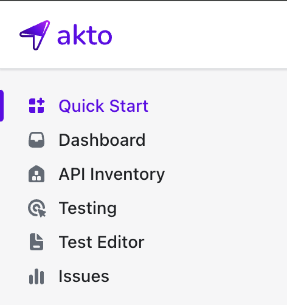

# Connect Akto with IIS

Microsoft IIS (Internet Information Services) is a widely used web server for hosting web applications on Windows. Integrating IIS with Akto enables you to automatically mirror API traffic (including headers and payloads) to the Akto backend, empowering deep visibility and continuous API security analysis.

To connect Akto with your IIS server, follow the steps below:

---

## Step 1: Deploy the Akto Data-Ingestion Service

Before configuring the IIS Traffic Connector, you need to deploy the Akto Data-Ingestion Service. Ensure that the service is running and accessible via a publicly available URL.

### 1.1 Download the Required Files

SSH into the instance where you want to deploy the data-ingestion service and run these commands:

```bash
wget https://raw.githubusercontent.com/akto-api-security/infra/refs/heads/feature/quick-setup/docker-compose-mini-runtime-data-ingestion.yaml
wget https://raw.githubusercontent.com/akto-api-security/infra/refs/heads/feature/quick-setup/data-ingestion-docker.env
wget https://raw.githubusercontent.com/akto-api-security/infra/refs/heads/feature/quick-setup/docker-threat-detection.env
wget https://raw.githubusercontent.com/akto-api-security/infra/refs/heads/feature/quick-setup/docker-mini-runtime.env
wget https://raw.githubusercontent.com/akto-api-security/infra/refs/heads/feature/quick-setup/watchtower.env
```

### 1.2 Retrieve the `DATABASE_ABSTRACTOR_SERVICE_TOKEN`

* Log in to the [Akto Dashboard](https://app.akto.io/)
* Navigate to the **Quick Start** tab in the left panel
    <figure><figcaption></figcaption></figure>
* Select **Hybrid SaaS Connector**
    <figure><figcaption></figcaption></figure>
* Copy the token from the **Runtime Service Command** section

### 1.3 Update the `docker-mini-runtime.env` File

Open the `docker-mini-runtime.env` file and replace `token` with the token you just copied:

```plaintext
DATABASE_ABSTRACTOR_SERVICE_TOKEN=token
```

### 1.4 Deploy the Data-Ingestion Service

Run the following command:

```bash
docker-compose -f docker-compose-mini-runtime-data-ingestion.yaml up -d
```

### 1.5 Note the IP Address of the Data-Ingestion Service

Ensure this IP is reachable from your IIS server. You will need this to forward the traffic data to Akto.

---

## Step 2: Install the IIS Traffic Connector

Akto provides a native IIS module that can capture HTTP request and response headers and payloads. This module supports both 64-bit and 32-bit environments.

👉 **Important:** You must download and use only one DLL — either 64-bit or 32-bit depending on your system. Regardless of which one you choose, always rename it to `AktoNativeIisTrafficCollector.dll`, move it to `C:\akto_configs`, and use that same name everywhere.

---

### 2.1 Prepare Configuration File

1. Create a folder at the root of your C drive:

   ```powershell
   mkdir C:\akto_configs
   ```

2. Inside it, create a file named `config.json` with the following content:

   ```json
   {
     "backendUrl": "https://DATA-INGESTION-SERVICE-URL/api/ingestData"
   }
   ```

   Replace `DATA-INGESTION-SERVICE-URL` with the address of your deployed Akto ingestion service.

---

### 2.2 Install the Module Globally (Recommended)

You need to register the Akto IIS module globally so it applies to all websites.

1. Download the correct DLL for your environment (pick **only one**):

   ```powershell
   # For 64-bit IIS
   Invoke-WebRequest -Uri https://github.com/akto-api-security/iis-collector-native-module/raw/refs/heads/master/x64/Release/AktoNativeIisTrafficCollector.dll -OutFile C:\akto_configs\AktoNativeIisTrafficCollector.dll

   # For 32-bit IIS
   Invoke-WebRequest -Uri https://github.com/akto-api-security/iis-collector-native-module/raw/refs/heads/master/x86/Release/AktoNativeIisTrafficCollector.dll -OutFile C:\akto_configs\AktoNativeIisTrafficCollector.dll
   ```

2. Open an **elevated command prompt (Administrator)** and run the following commands:

   ```cmd
   %windir%\system32\inetsrv\appcmd.exe install module /name:AktoTrafficConnector /image:"C:\akto_configs\AktoNativeIisTrafficCollector.dll" /add:true
   %windir%\system32\inetsrv\appcmd.exe set config /section:system.webServer/globalModules /+[name='AktoNativeIisTrafficCollector',image='C:\akto_configs\AktoNativeIisTrafficCollector.dll']
   %windir%\system32\inetsrv\appcmd.exe list config /section:system.webServer/globalModules
   ```

   These commands:

   * Register the `AktoTrafficConnector` module in IIS
   * Add it for **all sites** so that traffic from every hosted website is mirrored
   * Explicitly add `AktoNativeIisTrafficCollector` to the global modules section
   * List all registered global modules for verification

3. Restart your IIS server:
    ```bash
    iisreset
    ```

---

### 2.3 Add Module to a Specific Website Only (Alternative Method)

If you want to install the module for **just one website**, follow these steps:

1. Copy the correct DLL into a directory named `bin` under your site’s root folder (e.g., `C:\inetpub\wwwroot\MySite\bin`).

2. Update the `web.config` of that website:

```xml
<configuration>
  <system.webServer>
    <modules>
      <add name="AktoTrafficConnector" image="C:\inetpub\wwwroot\MySite\bin\AktoNativeIisTrafficCollector.dll" />
    </modules>
  </system.webServer>
</configuration>
```

3. Ensure the app pool identity has read access to this folder and its DLLs.

4. Restart your IIS server:
    ```bash
    iisreset
    ```

---

## Step 3: Verify the Integration

Once installed:

1. Make a few requests to your IIS-hosted APIs.
2. In your Akto dashboard, go to the **API Collections** tab and confirm that traffic is appearing.

If no traffic is appearing, check:

* IIS logs for module load errors.
* Check logs in `C:\akto_configs\logs\log_20xx.txt`
* Akto Data-Ingestion Service logs to ensure it’s receiving traffic.

---

## Get Support for your Akto setup

There are multiple ways to request support from Akto. We are 24×7 available through the following:

1. In-app `Intercom` support — message us via the chat icon in the Akto dashboard.
2. Join our [Discord channel](https://www.akto.io/community) for community support.
3. Email us at [help@akto.io](mailto:help@akto.io).
4. Visit our [Contact page](https://www.akto.io/contact-us).