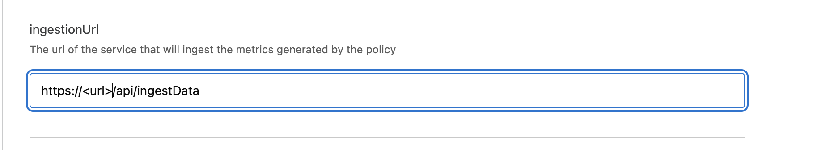

# Connect Akto with Mulesoft Flex Gateway

<figure><figcaption></figcaption></figure>

## Connect Akto with Mulesoft Flex Gateway

### Setup Akto Runtime and Data Ingestion Service

Follow these steps to add setup Akto Runtime and Data Ingestion Service -

1\. SSH into the instance where you want to deploy the above Akto services

2\. Run the following commands to download docker compose and env files

```
wget https://raw.githubusercontent.com/akto-api-security/infra/refs/heads/feature/quick-setup/docker-compose-data-ingestion-runtime.yml
wget https://raw.githubusercontent.com/akto-api-security/infra/refs/heads/feature/quick-setup/docker-mini-runtime.env
wget https://raw.githubusercontent.com/akto-api-security/infra/refs/heads/feature/quick-setup/data-ingestion-docker.env
wget https://raw.githubusercontent.com/akto-api-security/infra/refs/heads/feature/quick-setup/watchtower.env
```

3\. Modify ${AKTO\_KAFKA\_IP} in docker-compose-data-ingestion-runtime.yml with the ip of your instance on which runtime will be deployed

4\. Go to https://app.akto.io, and create your akto account. Login into your Account

5\. Click on Quick Start tab in left nav.

<figure><figcaption></figcaption></figure>

6\. Search for Hybrid SaaS Connector and click connect.

<figure><figcaption></figcaption></figure>

7\. Copy the token value under `Runtime Service Command` section. Replace the token string with the earlier copied value in docker-mini-runtime.env file.

```plaintext
DATABASE_ABSTRACTOR_SERVICE_TOKEN=token
```

8\. Run `docker-compose -f docker-compose-data-ingestion-runtime.yml -d`

9\. Make sure this instance is reachable from the instances where your api's are hosted, on which policy will be applied

## Connect Akto with Mulesoft Flex Gateway

### Setup Flex Policy

1\. Follow PDK Prerequisites on the Mulesoft documentation site, and setup the basic requirements

2\. Initialise a new project `anypoint-cli-v4 pdk policy-project create --name <my-custom-policy>`

3\. Clone the [repo](https://github.com/akto-api-security/mulesoft-policy).

4\. Copy content of gcl.yaml, lib.rs, Corgo.toml files, and paste these files in your project at respective locations.

5\. Compile the project by running

```
make build-asset-files
cargo build
make build
```

6\. Publish the policy to mulesoft exchange by running `make publish`

7\. Select your api's on which you want to apply Akto Policy.

8\. Copy the instance ip where Akto Runtime was deployed, and replace \<url> in the below string and use it as input param `ingestionUrl` to the policy

`https://<url>:9091/api/ingestData`

<figure><figcaption></figcaption></figure>
