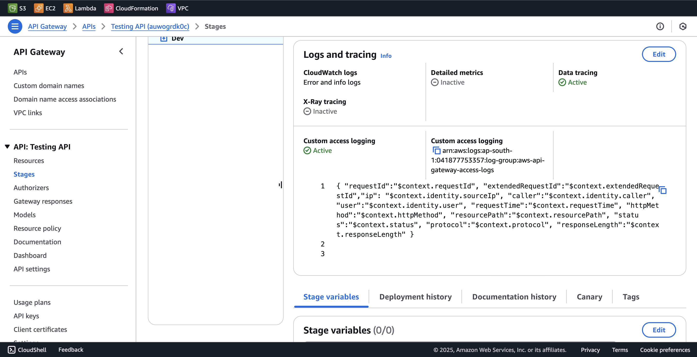

# Connect Akto with AWS API Gateway (Using Service Accounts)

AWS API Gateway is a fully managed service from AWS that helps developers create, publish, monitor, and secure APIs at scale. By integrating AWS API Gateway with Akto, you'll automatically discover and test the security of all your REST APIs, HTTP APIs, and WebSocket APIs deployed through API Gateway, ensuring comprehensive API security across your AWS infrastructure.

<figure><figcaption></figcaption></figure>

To connect Akto with AWS API Gateway using **Service Accounts (IRSA)**, follow these steps:

----------

## Step 1: Set Up and Configure API Gateway

### 1.1 Set up Akto Traffic Processor

Follow the steps mentioned [here](https://docs.akto.io/getting-started/traffic-processor/hybrid-saas) to set up the Akto Traffic Processor.

### 1.2 Add AWS API Gateway Connector

1.  Go to **API Gateway** in the AWS Console.
2.  Navigate to your API and click on `Stages` from the left menu.
    <figure><figcaption></figcaption></figure>
3.  Scroll down to the `Logs and tracing` section and click on `Edit`.
    <figure><figcaption></figcaption></figure>
4.  Select `Error and info logs` and `Data tracing` and save these settings.
    <figure><figcaption></figcaption></figure>
5.  Find out the `CloudWatch log group` for your API Gateway for the stage which has the above logs enabled and save it. You'll need it later. (You can find this in the **CloudWatch Logs** section under the AWS Console.)

----------

## Step 2: Set Up an EKS Cluster

If you don’t have an existing EKS cluster, you can create one using the AWS Console:

1.  Go to the **Amazon EKS** service in the AWS Management Console.
2.  Click on **Create Cluster**.
3.  Provide a name for your cluster and select the Kubernetes version.
4.  Choose the networking settings (VPC, subnets, security groups).
5.  Select an IAM role for the cluster.
6.  Select an IAM role for the node.
7.  Configure other optional settings and click **Create**.
8.  Copy the OpenID Connect (OIDC) provider URL from the Overview section of your EKS cluster. (You can find this under **EKS > Your Cluster > Overview > Details**.)

----------

## Step 3: Create an IAM Role for Service Account

### 3.1 Create an IAM Policy

1.  Go to the **IAM** service in the AWS Console.
    
2.  Click **Policies** on the left panel, then click **Create policy**.
    
3.  Select **JSON** as Policy editor.
    
4.  Paste the following JSON schema in the policy editor.
    
    ```json
    {
    	"Version": "2012-10-17",
    	"Statement": [
    		{
    			"Effect": "Allow",
    			"Action": [
    				"logs:DescribeLogGroups",
    				"logs:DescribeLogStreams",
    				"logs:GetLogEvents",
    				"logs:FilterLogEvents"
    			],
    			"Resource": [
    				"arn:aws:logs:<your-region>:<your-account-id>:log-group:<YOUR_LOG_GROUP_NAME>:*"
    			]
    		}
    	]
    }
    
    ```
    
    -   Replace `<your-region>` with your AWS region. (Find it in the top-right corner of the AWS Console.)
    -   Replace `<your-account-id>` with your AWS account ID. (You can find this under **IAM > Account Settings**.)
    -   Replace `<YOUR_LOG_GROUP_NAME>` with the CloudWatch log group name saved in Step 1.2.
5.  Click **Next** and review the permissions.
6.  After reviewing the permissions, click the **Save Changes** button.
    

### 3.2 Create an IAM Role

1.  Go to the **IAM** service in the AWS Console.
2.  Click **Roles** on the left panel, then click **Create role**.
3.  Select **Web Identity** as the trusted entity.
4.  Choose your EKS OIDC provider and enter the audience as `sts.amazonaws.com`.
5.  Click **Next** and move to the permissions step.
6.  Choose the policy we created in the previous step (3.1).
7.  Click **Next**, give the role a name, and create the role. (Save the role name as it will be needed later.)

### 3.3 Update Trust Policy

After creating the role, modify the trust policy in the **Trust relationships** section of the role created in the previous step.

```json
{
    "Version": "2012-10-17",
    "Statement": [
        {
            "Effect": "Allow",
            "Principal": {
                "Federated": "arn:aws:iam::<your-account-id>:oidc-provider/oidc.eks.<your-region>.amazonaws.com/id/<your-oidc-provider-id>"
            },
            "Action": "sts:AssumeRoleWithWebIdentity",
            "Condition": {
                "StringEquals": {
                    "oidc.eks.<your-region>.amazonaws.com/id/<your-oidc-provider-id>:aud": "sts.amazonaws.com",
                    "oidc.eks.<your-region>.amazonaws.com/id/<your-oidc-provider-id>:sub": "system:serviceaccount:<your-namespace>:service-account-eks"
                }
            }
        }
    ]
}

```

-   Replace `<your-region>` with your AWS region. (Find it in the top-right corner of the AWS Console.)
-   Replace `<your-account-id>` with your AWS account ID. (You can find this under **IAM > Account Settings**.)
-   Replace `<your-oidc-provider-id>` with the OIDC provider ID from Step 2.
-   Replace `<your-namespace>` with the Kubernetes namespace where the service account will be deployed. (Use `kubectl get namespaces` to check existing namespaces.)

Save the trust policy.

----------

## Step 4: Attach IAM Role to EKS Service Account

1.  Create a `service-account.yaml` file with the following content:
    
    ```yaml
    apiVersion: v1
    kind: ServiceAccount
    metadata:
      name: service-account-eks
      namespace: <your-namespace>
      annotations:
        eks.amazonaws.com/role-arn: arn:aws:iam::<aws-account-id>:role/<role-name>
    
    ```
    
    -   Replace `<aws-account-id>` with your AWS account ID.
    -   Replace `<role-name>` with the IAM role name created in Step 3.2.
    -   Replace `<your-namespace>` with the Kubernetes namespace where the service account will be deployed (use `kubectl get namespaces` to check existing namespaces). This should be the same as the one used in step 3.3.
2.  Apply the `service-account.yaml` file to your EKS cluster using the following `kubectl` command: `kubectl apply -f service-account.yaml`
    

----------

## Step 5: Update the Kubernetes Deployment YAML

1.  For `LOG_GROUP_NAME` and `AWS_REGION`, use the log group we saved earlier and the aws region it is deployed in.
3.  For `AKTO_KAFKA_BROKER_MAL`, use the value of the `mini-runtime` service we deployed in step 1.1.
```yaml
apiVersion: apps/v1
kind: Deployment
metadata:
  name: api-gateway-logging
  namespace: <your-namespace>
spec:
  replicas: 1
  selector:
    matchLabels:
        app: api-gateway-logging 
  template:
    metadata:
        labels:
          app: api-gateway-logging 
    spec:
      serviceAccountName: service-account-eks
      containers:
      - image: aktosecurity/mirror-api-logging:api-gateway-logging
        name: api-gateway-logging 
        imagePullPolicy: Always
        resources: {}
        env:
          - name: AKTO_BYTES_IN_THRESHOLD
            value: "100"
          - name: AKTO_TRAFFIC_BATCH_TIME_SECS
            value: "10"
          - name: AKTO_TRAFFIC_BATCH_SIZE
            value: "100"
          - name: AKTO_KAFKA_BROKER_MAL
            value: ""
          - name: CLOUDWATCH_READ_BATCH_SIZE
            value: "5"
          - name: LOG_GROUP_NAME
            value: ""
          - name: AWS_REGION
            value: ""
```

-   Replace `<your-namespace>` with the Kubernetes namespace used in Step 4.


Notes:
1. For assigning an IAM role to a Kubernetes service account, you can refer [here](https://docs.aws.amazon.com/eks/latest/userguide/pod-id-association.html).

----------

## Get Support for your Akto setup

-   **In-app support**: Message us in the Akto dashboard.
-   **Join our** **[Discord channel](https://www.akto.io/community)** **for community support.**
-   **Email**: Contact `help@akto.io`.
-   **Contact us** **[here](https://www.akto.io/contact-us)**.