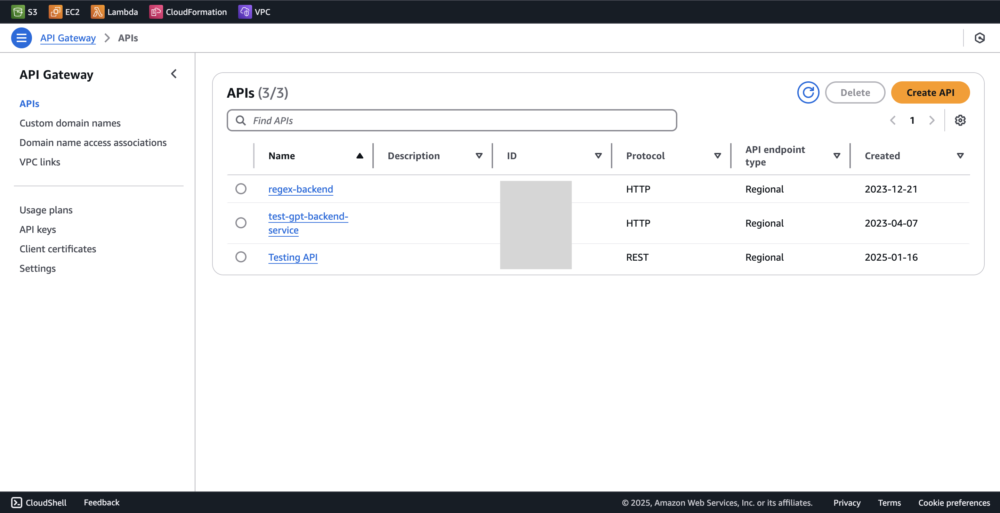
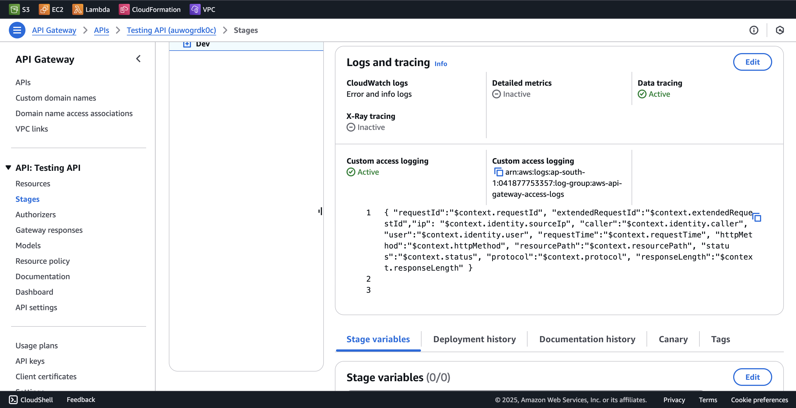
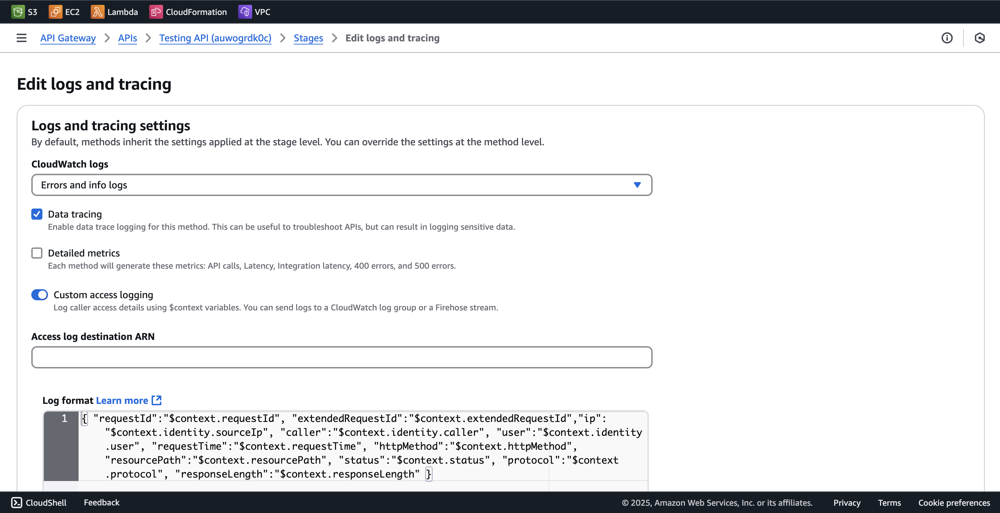

# Connect Akto with AWS API Gateway

AWS API Gateway is a fully managed service from AWS that helps developers create, publish, monitor, and secure APIs at scale. By integrating AWS API Gateway with Akto, you'll automatically discover and test the security of all your REST APIs, HTTP APIs, and WebSocket APIs deployed through API Gateway, ensuring comprehensive API security across your AWS infrastructure.

<figure><figcaption></figcaption></figure>

To connect Akto with AWS API Gateway, follow these steps -

1. Set up and configure Akto Traffic Processor. The steps are mentioned [here](https://docs.akto.io/getting-started/traffic-processor/hybrid-saas).
2.  Add AWS API Gateway connector

    1. Go to **API gateway** in AWS console
    2.  Go to your API, click on `Stages` from the left menu.

        <figure><figcaption></figcaption></figure>
    3.  Scroll down to `Logs and tracing` section and click on `Edit`.

        <figure><figcaption></figcaption></figure>
    4.  Select `Error and info logs` and `Data tracing` and save these settings.

        <figure><figcaption></figcaption></figure>
    5. Find out the `cloudwatch log group` for your API gateway for the stage which has the above logs enabled and save it. We'll need it later.
    6. Deploy the kubernetes deployment below.
       1. For `LOG_GROUP_NAME` and `AWS_REGION`, use the log group arn we saved earlier and the aws region it is deployed in.
       2. For `AKTO_KAFKA_BROKER_MAL`, use the value of the `mini-runtime` service we deployed in step 1.
       3. For `AWS_ACCESS_KEY_ID` , `AWS_SECRET_ACCESS_KEY` and `AWS_SESSION_TOKEN`, create AWS CLI keys, which have permissions to read from the cloudwatch log group which we've mentioned above.

```yaml
apiVersion: apps/v1
kind: Deployment
metadata:
  name: api-gateway-logging
spec:
  replicas: 1
  selector:
    matchLabels:
        app: api-gateway-logging 
  template:
    metadata:
        labels:
          app: api-gateway-logging 
    spec:
      containers:
      - image: aktosecurity/mirror-api-logging:api-gateway-logging
        name: api-gateway-logging 
        imagePullPolicy: Always
        resources: {}
        env:
          - name: AKTO_BYTES_IN_THRESHOLD
            value: "100"
          - name: AKTO_TRAFFIC_BATCH_TIME_SECS
            value: "10"
          - name: AKTO_TRAFFIC_BATCH_SIZE
            value: "100"
          - name: AKTO_KAFKA_BROKER_MAL
            value: ""
          - name: AWS_ACCESS_KEY_ID
            value: ""
          - name: AWS_SECRET_ACCESS_KEY
            value: ""
          - name: AWS_SESSION_TOKEN
            value: ""
          - name: CLOUDWATCH_READ_BATCH_SIZE
            value: "5"
          - name: LOG_GROUP_NAME
            value: ""
          - name: AWS_REGION
            value: ""
```

Notes:

1. To create AWS CLI credentials, you can take reference from the [official AWS docs](https://docs.aws.amazon.com/sdkref/latest/guide/access-iam-users.html).
2. For AWS IAM policy permissions for cloudwatch, you can refer [here](https://docs.aws.amazon.com/apigateway/latest/developerguide/set-up-logging.html#apigateway-cloudwatch-log-formats).

## Get Support for your Akto setup

There are multiple ways to request support from Akto. We are 24X7 available on the following:

1. In-app `intercom` support. Message us with your query on intercom in Akto dashboard and someone will reply.
2. Join our [discord channel](https://www.akto.io/community) for community support.
3. Contact `help@akto.io` for email support.
4. Contact us [here](https://www.akto.io/contact-us).
