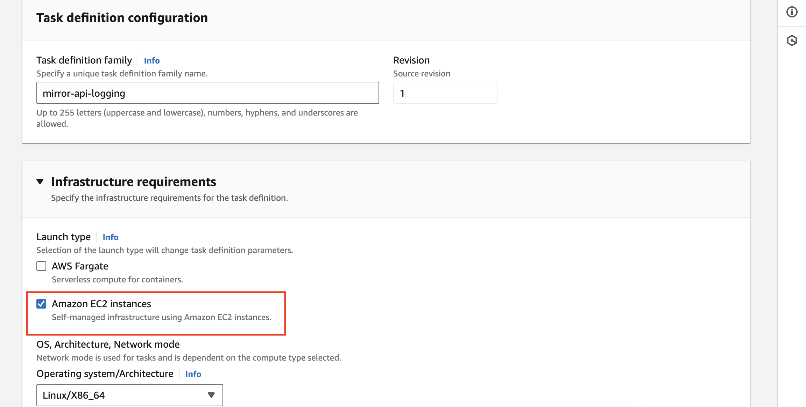
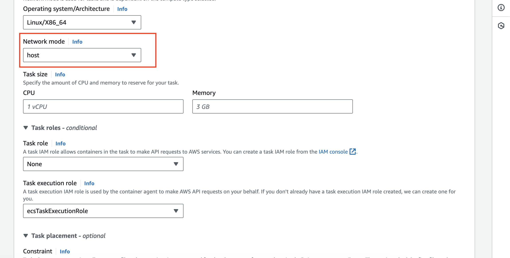
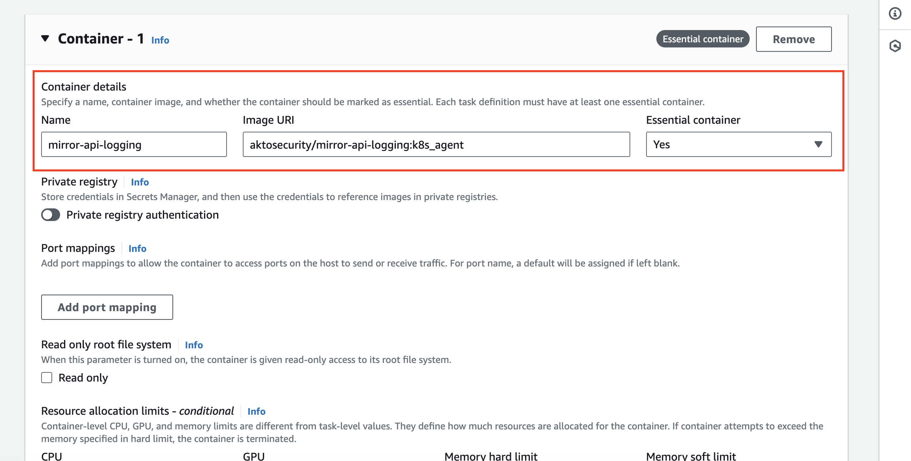
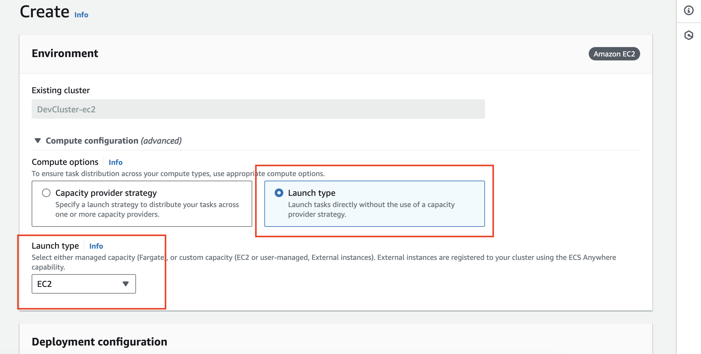

# Connect Akto with AWS ECS

<figure><figcaption></figcaption></figure>

## Introduction

Learn about how to send API traffic data from AWS ECS setup to Akto from your environment. Depending on your ECS infrastructure type refer to these respective sections:

1. [FARGATE infrastructure](aws-ecs.md#adding-akto-traffic-collector-to-ecs-fargate-cluster)
2. [EC2 instances infrastructure](aws-ecs.md#adding-akto-traffic-collector-to-ecs-ec2-instances-cluster)

## Adding Akto traffic collector to ECS FARGATE cluster

When the ECS cluster is running on AWS FARGATE infrastructure, we will add a container to the task definition of the task, from which we want to monitor. Refer the below image to check your cluster type.

<figure><figcaption><p>ECS FARGATE infrastructure type</p></figcaption></figure>

1. Setup Akto data processor using the guide [here](../../getting-started/quick-start-with-akto-self-hosted/helm-deploy.md). Keep the value `AKTO_NLB_IP` handy, as we will need them later.
2.  Add a container with the configuration defined below. Please replace the `AKTO_NLB_IP` variable, as obtained from [step 1](aws-ecs.md#adding-akto-traffic-collector-to-ecs-fargate-cluster).

    ```bash
    {
        "name": "mirror-api-logging",
        "image": "aktosecurity/mirror-api-logging:k8s_agent",
        "cpu": 1024,
        "memory": 1024,
        "portMappings": [],
        "essential": false,
        "environment": [
            {
                "name": "AKTO_TRAFFIC_BATCH_TIME_SECS",
                "value": "10"
            },
            {
                "name": "AKTO_MONGO_CONN",
                "value": "mongodb://0.0.0.0:27017/admini"
            },
            {
                "name": "AKTO_TRAFFIC_BATCH_SIZE",
                "value": "10"
            },
            {
                "name": "AKTO_INFRA_MIRRORING_MODE",
                "value": "gcp"
            },
            {
                "name": "AKTO_KAFKA_BROKER_MAL",
                "value": "<AKTO_NLB_IP>:9092"
            }
        ],
        "environmentFiles": [],
        "mountPoints": [],
        "volumesFrom": [],
        "systemControls": []
    }
    ```

    <figure><figcaption><p>ECS task definition</p></figcaption></figure>
3.  After adding this definition to the task, update the task revision in the service.

    <figure><figcaption><p>Update ECS service</p></figcaption></figure>
4.  The containers for the task should show both your primary container and mirror-api-logging container.

    <figure><figcaption><p>Updated service</p></figcaption></figure>

## Adding Akto traffic collector to ECS EC2 instances cluster

When the ECS cluster is a EC2 instances cluster, we will create a task definition for the mirror-api-logging container and run the task as a daemonset.

<figure><figcaption><p>Cluster configuration</p></figcaption></figure>

1. Setup Akto data processor using the guide [here](broken-reference/). Keep the value `AKTO_NLB_IP` handy, as we will need them later.
2.  We will create a new task definition with launch type as EC2 instances, network mode host and the container details as follows. You can directly create a new task definition using the JSON given below. You can also refer the screenshots attached. Please replace the `AKTO_NLB_IP` variable, as obtained from [step 1](aws-ecs.md#adding-akto-traffic-collector-to-ecs-ec2-instances-cluster).

    ```bash
    {
        "family": "mirror-api-logging",
        "containerDefinitions": [
            {
                "name": "mirror-api-logging",
                "image": "aktosecurity/mirror-api-logging:k8s_agent",
                "cpu": 1024, 
                "memory": 1024,
                "portMappings": [],
                "essential": true,
                "environment": [
                    {
                        "name": "AKTO_TRAFFIC_BATCH_TIME_SECS",
                        "value": "10"
                    },
                    {
                        "name": "AKTO_MONGO_CONN",
                        "value": "mongodb://0.0.0.0:27017/admini"
                    },
                    {
                        "name": "AKTO_TRAFFIC_BATCH_SIZE",
                        "value": "10"
                    },
                    {
                        "name": "AKTO_INFRA_MIRRORING_MODE",
                        "value": "gcp"
                    },
                    {
                        "name": "AKTO_KAFKA_BROKER_MAL",
                        "value": "<AKTO_NLB_IP>:9092"
                    }
                ],
                "environmentFiles": [],
                "mountPoints": [],
                "volumesFrom": [],
                "ulimits": [],
                "logConfiguration": {
                    "logDriver": "awslogs",
                    "options": {
                        "awslogs-create-group": "true",
                        "awslogs-group": "/ecs/mirror-api-logging",
                        "awslogs-region": "ap-south-1",
                        "awslogs-stream-prefix": "ecs"
                    },
                    "secretOptions": []
                },
                "systemControls": []
            }
        ],
        "executionRoleArn": "<Use default execution role>",
        "networkMode": "host",
        "requiresCompatibilities": [
            "EC2"
        ],
        "runtimePlatform": {
            "cpuArchitecture": "X86_64",
            "operatingSystemFamily": "LINUX"
        }
    }
    ```

    <figure><figcaption><p>Task configuration</p></figcaption></figure>

    <figure><figcaption><p>Task configuration</p></figcaption></figure>

    <figure><figcaption><p>Task configuration</p></figcaption></figure>

    <figure><figcaption><p>Task configuration</p></figcaption></figure>
3.  We will create a daemonset service with launch type EC2. Go to services tab in the ECS cluster and click on `Create`.

    <figure><figcaption><p>Daemonset configuration</p></figcaption></figure>
4.  Select `Launch type` in `Compute options` and `EC2` in `Launch type`.

    <figure><figcaption><p>Daemonset configuration</p></figcaption></figure>
5.  Select `Service` in `Application type`, select `mirror-api-logging` in `Family` ( The task definition we just created ), enter `mirror-api-logging` as `Service name` and set the `Service type` as `Daemon`. Then click on `Create` on the bottom of the page.

    <figure><figcaption><p>Daemonset configuration</p></figcaption></figure>
6. Voila, you have created a daemonset in ECS. You should see the traffic in Akto dashboard in some time.
