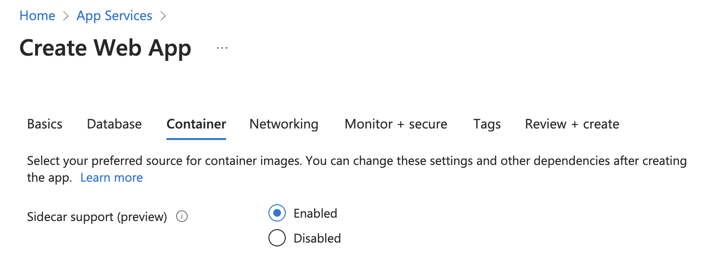
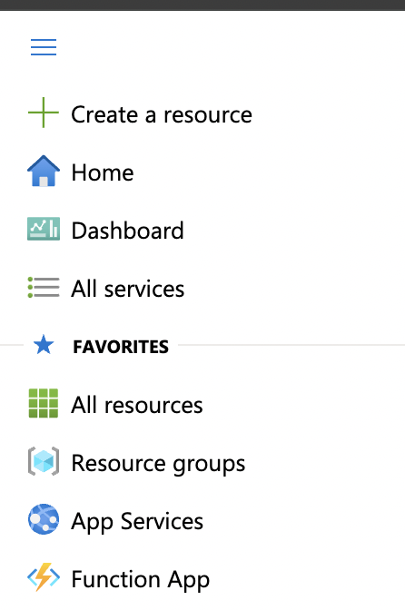
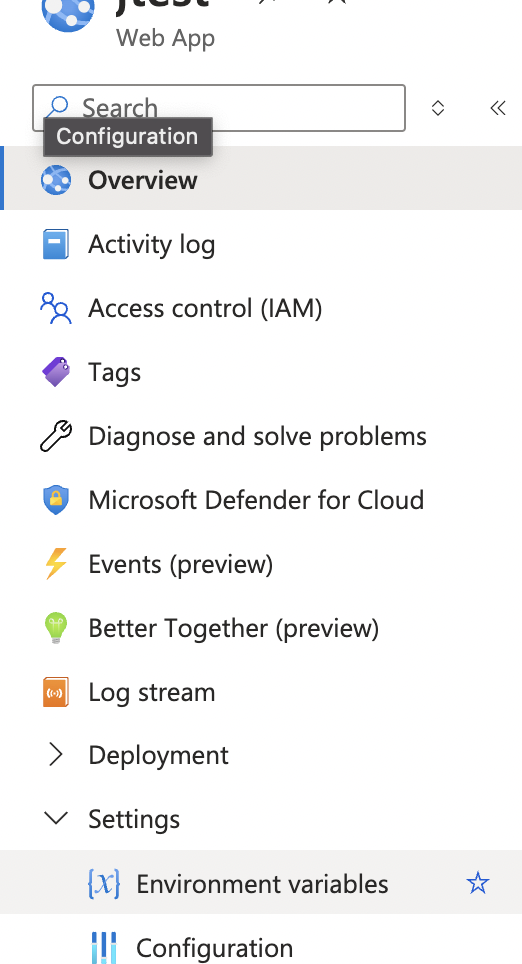
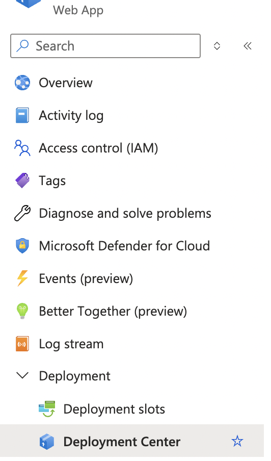
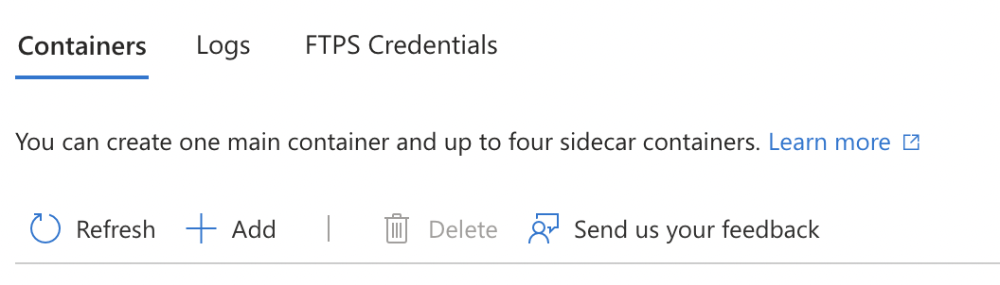
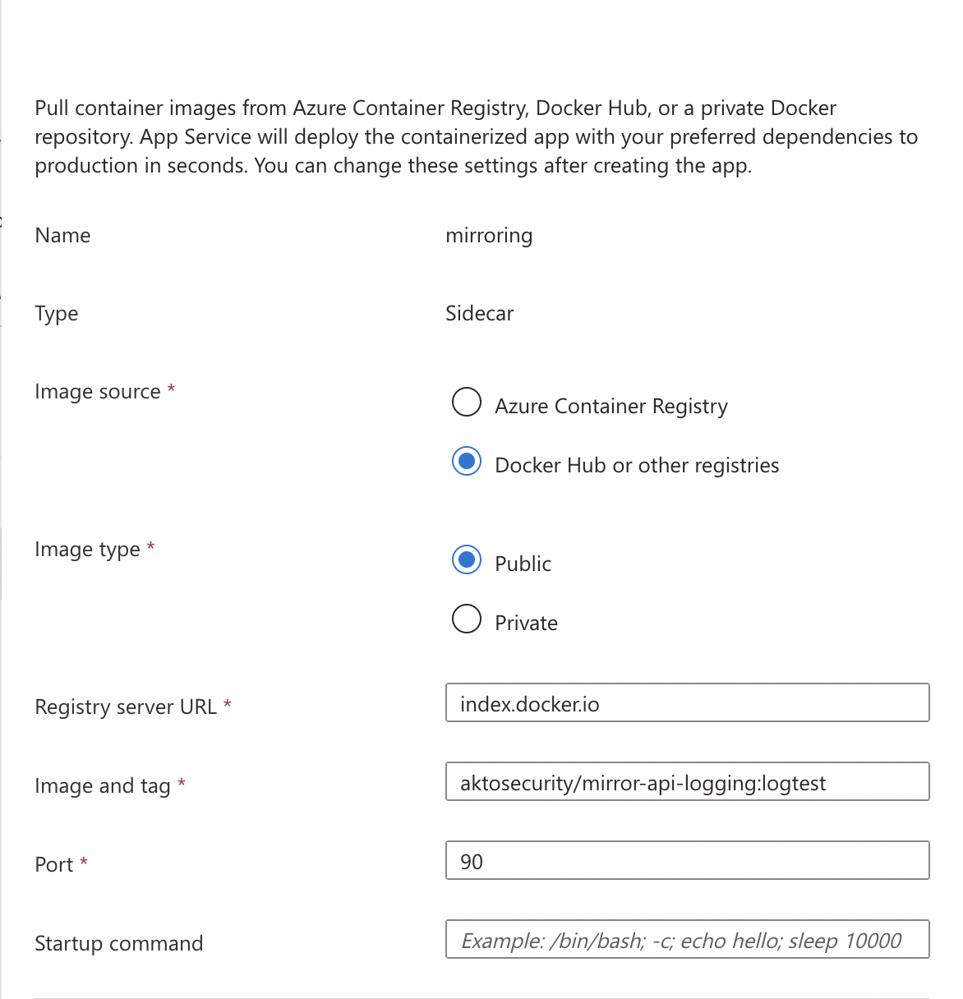

# Connect Akto with Azure App Services

<figure><figcaption></figcaption></figure>

## Introduction

Learn about how to send API traffic data from Azure App Services Web App to Akto.

<figure><figcaption></figcaption></figure>

## Prerequisites

1.  Your Web App should have sidecar support enabled at the time of creation.

    <figure><figcaption></figcaption></figure>

## Adding Akto traffic collector to Azure App Services Web App

1.  Open Azure Portal and click on App Services in the left navbar.

    <figure><figcaption></figcaption></figure>
2. Click on the web app for which you want to setup traffic mirroring.
3.  Click on Environment Variables under the Settings tab in left navbar.

    <figure><figcaption></figcaption></figure>
4. Add the following env variables.

```bash
AKTO_INFRA_MIRRORING_MODE=gcp
AKTO_KAFKA_BROKER_MAL=<Akto_Runtime_Load_Balancer_DNS> // modify this value with Akto Runtime Load Balancer DNS
AKTO_MONGO_CONN=mongodb://0.0.0.0:27017
AKTO_TRAFFIC_BATCH_SIZE=100
AKTO_TRAFFIC_BATCH_TIME_SECS=10
```

Click on Apply for the changes to be reflected.

5.  Go to your web app, and click on Deployment Center under the Deployment tab in left navbar.

    <figure><figcaption></figcaption></figure>
6.  Click on Add button, and add the akto traffic mirroring sidecar.

    <figure><figcaption></figcaption></figure>
7. Enter the following values to spawn a new Akto mirroring container

```bash
Name -> mirroring
Image source -> Docker Hub or other registeries
Image Type -> Public
Registry server URL -> index.docker.io
Image and tag -> aktosecurity/mirror-api-logging:k8s_agent
Port -> 90
```

<figure><figcaption></figcaption></figure>

8. Click on Apply, and traffic should start population in a couple of minutes.
