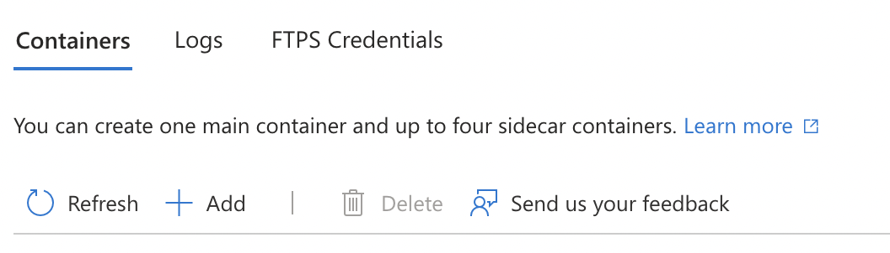
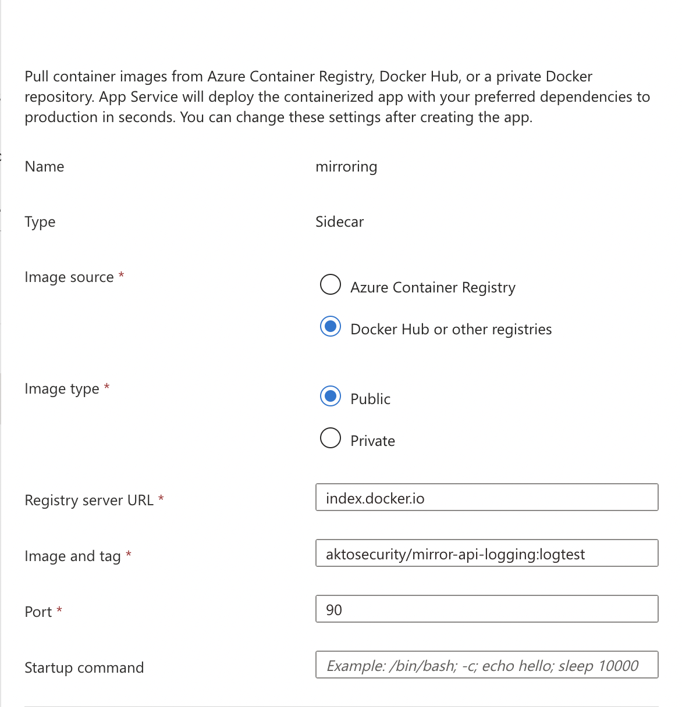

# Connect Akto with Azure Container App

1. Use the following env vars to configure the sidecar

```
AKTO_INFRA_MIRRORING_MODE=gcp
AKTO_KAFKA_BROKER_MAL=<Akto_Runtime_Load_Balancer_DNS> // modify this value with Akto Runtime Load Balancer DNS
AKTO_MONGO_CONN=mongodb://0.0.0.0:27017
AKTO_TRAFFIC_BATCH_SIZE=100
AKTO_TRAFFIC_BATCH_TIME_SECS=10
```

2. Click on Add button, and add the akto traffic mirroring sidecar.

<figure><figcaption></figcaption></figure>

3. Enter the following values to spawn a new Akto mirroring container

```bash
Name -> mirroring
Image source -> Docker Hub or other registeries
Image Type -> Public
Registry server URL -> index.docker.io
Image and tag -> aktosecurity/mirror-api-logging:k8s_agent
Port -> 90
```

<figure><figcaption></figcaption></figure>

4. Click on Apply, and traffic should start population in a couple of minutes.
