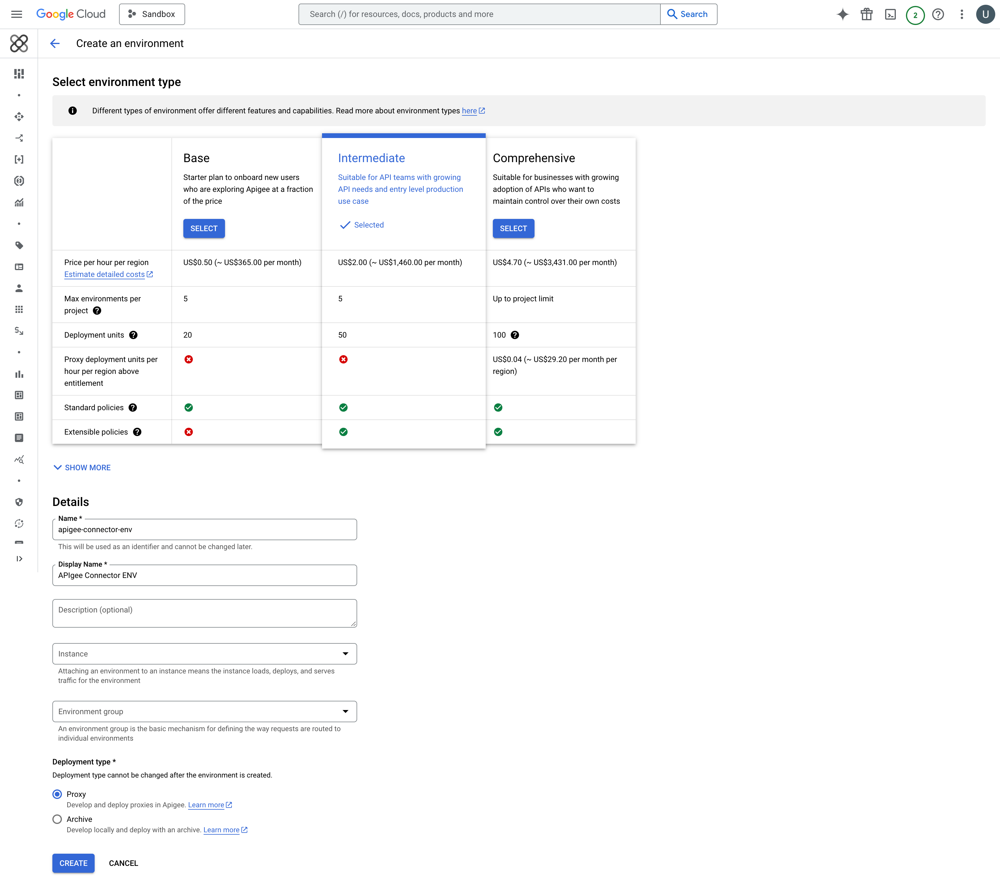

# Connect Akto with Apigee

Apigee is Google Cloud's full-lifecycle API management platform that helps enterprises design, secure, and scale APIs. Integrating Apigee with Akto enables automatic discovery and security testing of all APIs managed through your Apigee gateway, providing comprehensive visibility and continuous security assessment of your API infrastructure.

<figure><figcaption></figcaption></figure>

***

## Step 1: Deploy the Akto Data-Ingestion Service

Before setting up the Apigee connector, deploy the Akto Data-Ingestion Service by following these steps:

### 1.1 Download the Required Files

SSH into the instance where you want to deploy the data-ingestion service and run these commands:

```bash
wget https://raw.githubusercontent.com/akto-api-security/infra/refs/heads/feature/quick-setup/docker-compose-data-ingestion-runtime.yml
wget https://raw.githubusercontent.com/akto-api-security/infra/refs/heads/feature/quick-setup/data-ingestion-docker.env
wget https://raw.githubusercontent.com/akto-api-security/infra/refs/heads/feature/quick-setup/docker-mini-runtime.env
wget https://raw.githubusercontent.com/akto-api-security/infra/refs/heads/feature/quick-setup/watchtower.env

```

### 1.2 Retrieve the `DATABASE_ABSTRACTOR_SERVICE_TOKEN`

* Log in to the [Akto Dashboard](https://app.akto.io/).
*   Navigate to the **Quick Start** tab in the left panel.

    <figure><figcaption></figcaption></figure>
*   Select **Hybrid SaaS Connector** and copy the token from the **Runtime Service Command** section.

    <figure><figcaption></figcaption></figure>

### 1.3 Update the `docker-mini-runtime.env` File

* Open the `docker-mini-runtime.env` file and replace `token` with the `DATABASE_ABSTRACTOR_SERVICE_TOKEN` you retrieved earlier.

```plaintext
DATABASE_ABSTRACTOR_SERVICE_TOKEN=token
```

### 1.4 Deploy the Data-Ingestion Service

Run the following command to start the data-ingestion service:

```bash
docker-compose -f docker-compose-data-ingestion-runtime.yml up -d
```

### 1.5 Note the IP Address of the Data-Ingestion Service

Ensure the instance is accessible from the network where your Apigee API proxy is configured. Note the instance's IP address, as it will be required by the Apigee connector to send traffic data.

***

## Step 2: Configure Apigee to Use the Akto Data-Ingestion Service

You can choose either option below for Step 2:

* **Option A:** Manual setup from the GCP Apigee UI.
* **Option B:** Automated setup using Terraform scripts from Akto's infra repository.

Both options configure Akto ingestion in Apigee. Option B is recommended for repeatable CI/CD-friendly deployments.

### 2.1 Create or Choose an Apigee Environment

To configure the Akto connector, you need an **Intermediate** or **Comprehensive** environment in Apigee, as the JavaScript policy is not supported in the **Base** environment.

#### Steps to Create an Environment:

1. Log in to the [Apigee Management Console](https://console.cloud.google.com/apigee/overview).
2.  Navigate to **Management → Environments** from the left-side navigation bar.

    <figure><figcaption></figcaption></figure>
3.  Click **+ Create Environment**.

    <figure><figcaption></figcaption></figure>
4. Provide the required details:
   * **Name**: Specify a name for your environment.
   * **Environment Type**: Choose **Intermediate** or **Comprehensive**.
5.  Click **Create** to finalize your environment setup.

    <figure><figcaption></figcaption></figure>

If you already have an **Intermediate** or **Comprehensive** environment, you can skip this step and proceed to the next section.

### 2.2 Option A: Manual Setup from GCP UI (Shared Flow + Flow Hook)

This is the manual environment-wide setup.

1. In Apigee, go to **Proxy development → Shared Flows** and click **+ Create**.
        <figure><figcaption></figcaption></figure>
2. Create a shared flow (for example: `akto-traffic-collector`).
3. Open the shared flow then go to **Develop** and click add **Policies +** button and add a **JavaScript** policy (for example: `AktoJavascript`).
    <figure><figcaption></figcaption></figure>
4. Create a JS resource file named `AktoPolicy.js` and paste the script below.
5. Save and deploy the shared flow to your target environment.
    <figure><figcaption></figcaption></figure>
6. Go to **Management → Environments → <your-environment> → Flow Hooks**.
7. Attach the shared flow to a hook point (recommended: `PostProxyFlowHook`).
    <figure><figcaption></figcaption></figure>

```javascript
var friendlyHttpStatus = {
  "200": "OK",
  "201": "Created",
  "202": "Accepted",
  "203": "Non-Authoritative Information",
  "204": "No Content",
  "205": "Reset Content",
  "206": "Partial Content",
  "300": "Multiple Choices",
  "301": "Moved Permanently",
  "302": "Found",
  "303": "See Other",
  "304": "Not Modified",
  "305": "Use Proxy",
  "306": "Unused",
  "307": "Temporary Redirect",
  "400": "Bad Request",
  "401": "Unauthorized",
  "402": "Payment Required",
  "403": "Forbidden",
  "404": "Not Found",
  "405": "Method Not Allowed",
  "406": "Not Acceptable",
  "407": "Proxy Authentication Required",
  "408": "Request Timeout",
  "409": "Conflict",
  "410": "Gone",
  "411": "Length Required",
  "412": "Precondition Required",
  "413": "Request Entity Too Large",
  "414": "Request-URI Too Long",
  "415": "Unsupported Media Type",
  "416": "Requested Range Not Satisfiable",
  "417": "Expectation Failed",
  "418": "I'm a teapot",
  "429": "Too Many Requests",
  "500": "Internal Server Error",
  "501": "Not Implemented",
  "502": "Bad Gateway",
  "503": "Service Unavailable",
  "504": "Gateway Timeout",
  "505": "HTTP Version Not Supported"
};

function getHeaderMap(prefix, namesVar) {
  var result = {};
  var names = context.getVariable(namesVar);
  names = (names || "") + "";
  if (!names || names.length < 2) {
    return result;
  }
  var arr = names.slice(1, -1).split(", ");
  for (var i = 0; i < arr.length; i++) {
    var key = arr[i];
    if (!key) {
      continue;
    }
    result[key] = context.getVariable(prefix + key);
  }
  return result;
}

try {
  var requestPath = context.getVariable("request.uri");
  var queryString = context.getVariable("request.querystring");
  var method = context.getVariable("request.verb");
  var requestPayload = context.getVariable("request.content");
  var responsePayload = context.getVariable("response.content");
  var statusCode = context.getVariable("response.status.code");
  var statusText = friendlyHttpStatus[statusCode] || "OK";
  var rawTime = context.getVariable("system.timestamp");
  var epochTimeSecond = Math.floor((rawTime || 0) / 1000);
  var clientIp = context.getVariable("request.header.x-forwarded-for") || context.getVariable("client.ip");

  var requestHeadersRes = getHeaderMap("request.header.", "request.headers.names");
  var responseHeadersRes = getHeaderMap("response.header.", "response.headers.names");

  var trafficData = {
    path: requestPath + (queryString ? "?" + queryString : ""),
    requestHeaders: JSON.stringify(requestHeadersRes, null, 2),
    responseHeaders: JSON.stringify(responseHeadersRes, null, 2),
    method: method,
    requestPayload: requestPayload || "",
    responsePayload: responsePayload || "",
    ip: clientIp || "0.0.0.0",
    time: "" + epochTimeSecond,
    statusCode: "" + statusCode,
    type: "HTTP/1.1",
    status: statusText,
    akto_account_id: "1000000",
    akto_vxlan_id: "0",
    is_pending: "false",
    source: "MIRRORING"
  };

  var payload = { batchData: [trafficData] };
  var ingestionUrl = "https://<data-ingestion-service-ip>:9091/api/ingestData";
  var req = new Request(ingestionUrl, "POST", { "Content-Type": "application/json" }, JSON.stringify(payload));
  httpClient.send(req, function(response, error) {
    if (error) {
      print("Akto ingestion error: " + error);
    }
  });
} catch (e) {
  print("Akto policy error: " + e);
}
```

Important policy behavior:

* Set JavaScript policy `continueOnError` to `true`.
* Keep ingestion call asynchronous (`httpClient.send(..., callback)`).

### 2.3 Option B: Terraform Automation

Use Terraform from:

* **Repository:** [https://github.com/akto-api-security/infra](https://github.com/akto-api-security/infra)
* **Branch:** `feature/quick-setup`
* **Folder:** `api-gateway-connect-terraform`

1. Clone and switch to the required branch:

```bash
git clone https://github.com/akto-api-security/infra.git
cd infra
git checkout feature/quick-setup
cd api-gateway-connect-terraform
```

2. Provide the required values:

* `project_id`
* `apigee_environment`
* `data_ingestion_service_url` (from Step 1)

3. Run Terraform:

```bash
terraform init
terraform apply
```

This automation creates and deploys the Apigee shared flow and attaches it to the selected environment flow hook.

### 2.4 Test the Integration

* Send test API traffic through Apigee.
* Verify in the Akto dashboard that traffic is being ingested.

***

### Get Support for your Akto setup

There are multiple ways to request support from Akto. We are 24X7 available on the following:

1. In-app `intercom` support. Message us with your query on intercom in Akto dashboard and someone will reply.
2. Join our [discord channel](https://www.akto.io/community) for community support.
3. Contact `help@akto.io` for email support.
4. Contact us [here](https://www.akto.io/contact-us).
