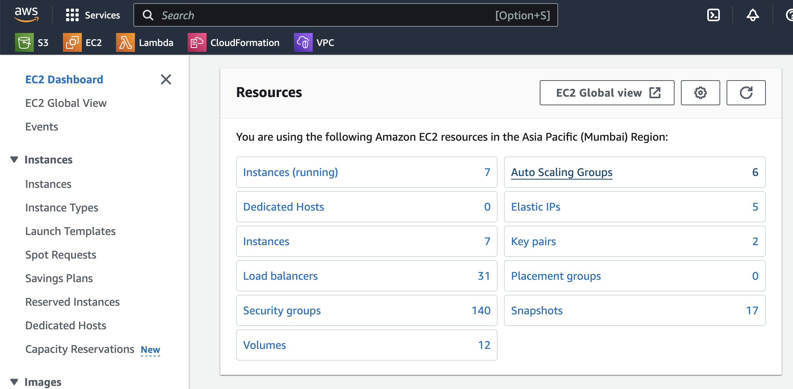
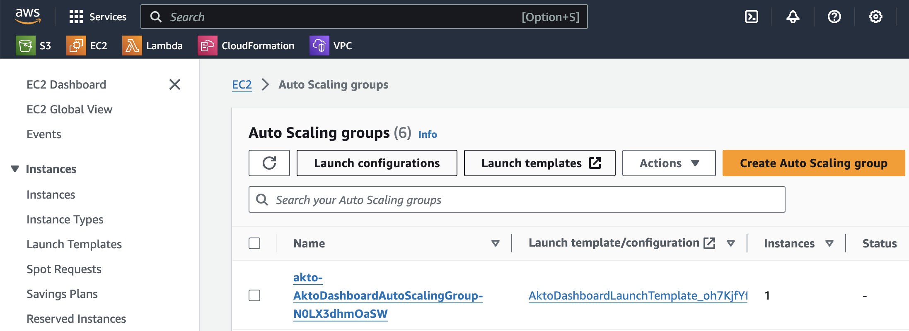
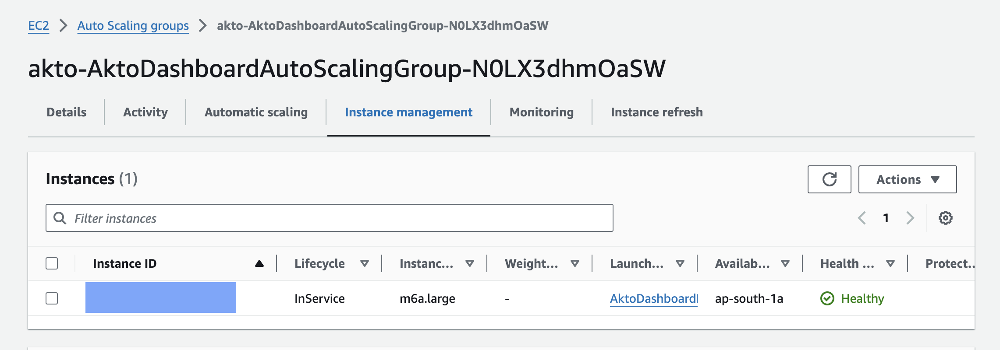
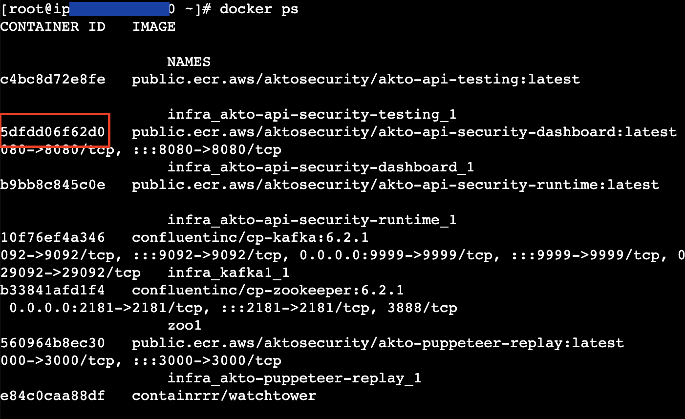
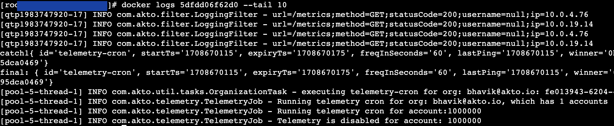

# How to get logs from Akto

You can deploy Akto on multiple platforms like AWS, k8s etc. Please follow the below guide to find logs on your respective platform.

## AWS using Auto scaling group

1. If you've deployed Akto on `AWS` using an auto scaling group, log in to AWS console and go to `EC2 dashboard`.

<figure><figcaption></figcaption></figure>

2. Go to `Auto scaling group` and find the `akto-dashboard` auto scaling group.

<figure><figcaption></figcaption></figure>

3. Find the associated EC2 instance in `Instance management` tab and SSH inside that instance. To SSH inside the instance, you can refer to [this AWS guide](https://docs.aws.amazon.com/AWSEC2/latest/UserGuide/connect-linux-inst-ssh.html).

<figure><figcaption></figcaption></figure>

4. Login as the root user using `sudo su -` and run `docker ps` to find the running containers.

<figure><figcaption></figcaption></figure>

5. You can find the logs for any container using the following command `docker logs <container-id> --tail 100` . Since there can be many logs, we are using `--tail 100` , you can increase this number for older logs or add `-f` flag for running logs.

<figure><figcaption></figcaption></figure>