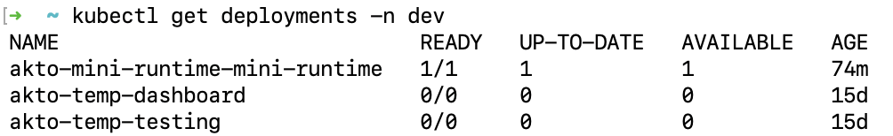
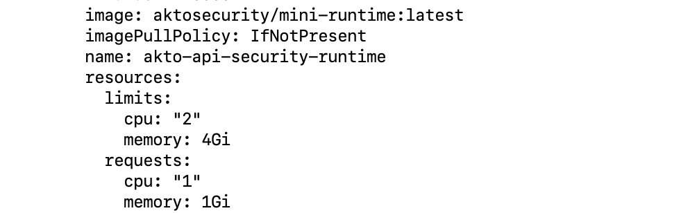
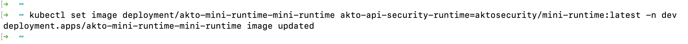
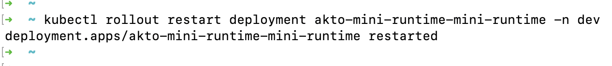
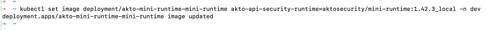

# How to update helm deployments

1. Check the image pull policy for the deployment. To check the image pull policy run the following commands.

    ```bash
    kubectl get deployments -n dev
    kubectl get deployment akto-mini-runtime-mini-runtime -n dev -o yaml
    ```

<figure><figcaption></figcaption></figure>
<figure><figcaption></figcaption></figure>

2. According to your image pull policy, follow ahead:

    1. **imagePullPolicy: Always** : If image pull policy is set to always, first check if the tag for the image is set to `latest`, if not then set it. Then run the rollout command. This will restart the pods in the deployment and download the latest builds.

        ```bash
        kubectl set image deployment/akto-mini-runtime-mini-runtime akto-api-security-runtime=aktosecurity/mini-runtime:latest -n dev
        kubectl rollout restart deployment akto-mini-runtime-mini-runtime -n dev
        ```
    <figure><figcaption></figcaption></figure>
    <figure><figcaption></figcaption></figure>

    2. **imagePullPolicy: IfNotPresent** : If image pull policy is set to IfNotPresent, we would need to use versioned images for the modules which would contain the newer builds.

        ```bash
        kubectl set image deployment/akto-mini-runtime-mini-runtime akto-api-security-runtime=aktosecurity/mini-runtime:1.42.3_local -n dev
        ```
        <figure><figcaption></figcaption></figure>

## Get Support for your Akto setup

There are multiple ways to request support from Akto. We are 24X7 available on the following:

1. In-app `intercom` support. Message us with your query on intercom in Akto dashboard and someone will reply.
2. Join our [discord channel](https://www.akto.io/community) for community support.
3. Contact `help@akto.io` for email support.
4. Contact us [here](https://www.akto.io/contact-us).
